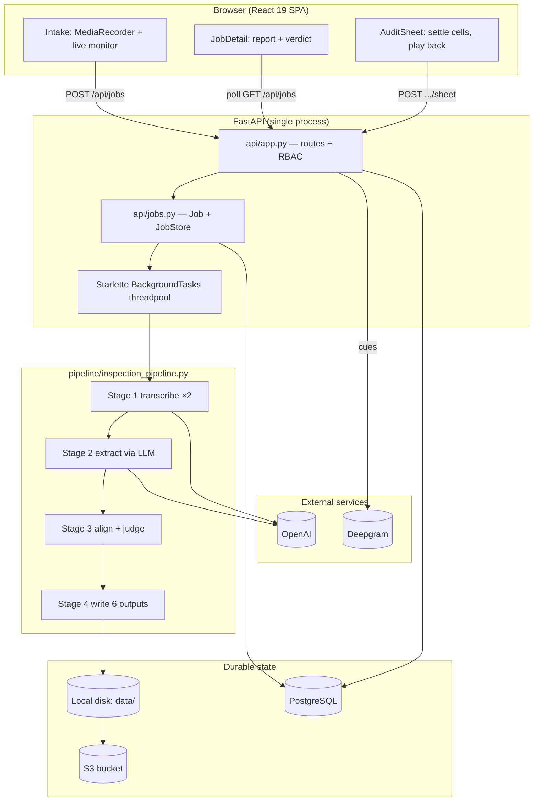
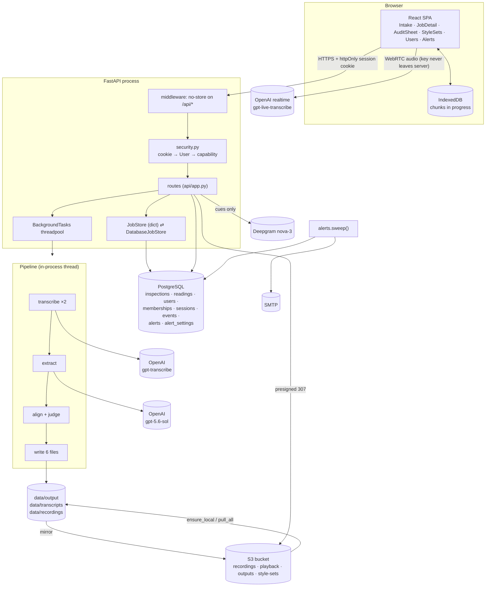
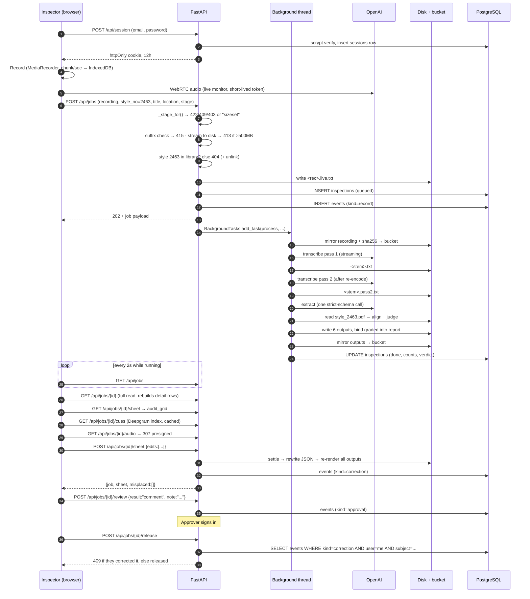
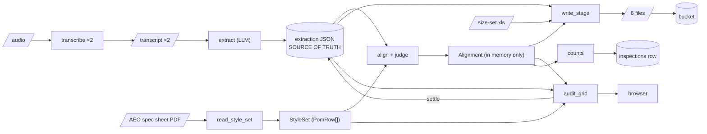

# Triburg QA — Project Documentation

> **Source of truth:** the repository at `D:\Divyansh\Projects\Shivalika_AI\stt`, read in full on **29 September 2026**.
> Every claim below is traceable to a file, a function or a test. Anything that cannot be established from the
> code is marked `Not determinable from the code — requires real-world measurement.`
> Anything I concluded rather than read is marked **[Inference]**.
>
> **Verified on this checkout, today:**
> - `pytest` → **516 passed** (149.87s)
> - `npm test` (vitest) → **102 passed**, 7 test files
> - Alembic migrations on disk: **13**
> - Style sets in `data/StyleSets/`: **9 PDFs** · recordings: **92** · transcripts: **202** · generated outputs: **667**

---

## Table of contents

| § | Section |
|---|---|
| 1 | [Executive Summary](#1-executive-summary) |
| 2 | [Project Overview](#2-project-overview) |
| 3 | [Problem Statement](#3-problem-statement) |
| 4 | [Existing / Old Process](#4-existing--old-process) |
| 5 | [Proposed Solution](#5-proposed-solution) |
| 6 | [Project Features](#6-project-features) |
| 7 | [SizeSet — Detailed Deep Dive](#7-sizeset--detailed-deep-dive) |
| 8 | [SizeSet Architecture](#8-sizeset-architecture) |
| 9 | [SizeSet End-to-End Walkthrough](#9-sizeset-end-to-end-walkthrough) |
| 10 | [SizeSet Business Logic](#10-sizeset-business-logic) |
| 11 | [SizeSet Code Structure](#11-sizeset-code-structure) |
| 12 | [SizeSet Data Flow](#12-sizeset-data-flow) |
| 13 | [SizeSet Error Handling](#13-sizeset-error-handling) |
| 14 | [SizeSet Performance](#14-sizeset-performance) |
| 15 | [SizeSet Scalability](#15-sizeset-scalability) |
| 16 | [SizeSet Security](#16-sizeset-security) |
| 17 | [SizeSet Testing](#17-sizeset-testing) |
| 18 | [SizeSet Deployment](#18-sizeset-deployment) |
| 19 | [Other Features](#19-other-features) |
| 20 | [Technology Stack](#20-technology-stack) |
| 21 | [Before vs After](#21-before-vs-after) |
| 22 | [How SizeSet Saves Time](#22-how-sizeset-saves-time) |
| 23 | [Business / Operational Impact](#23-business--operational-impact) |
| 24 | [Current Limitations](#24-current-limitations) |
| 25 | [Future Roadmap](#25-future-roadmap) |
| 26 | [Diagrams Required for Presentation](#26-diagrams-required-for-presentation) |
| 27 | [Presentation Story](#27-presentation-story) |
| 28 | [Presentation Slide Plan](#28-presentation-slide-plan) |
| 29 | [Q&A Preparation](#29-qa-preparation) |
| 30 | [Final Executive Summary](#30-final-executive-summary) |

---

## 1. Executive Summary

### What is Triburg?

**Triburg** is a garment buying/QA house. It inspects clothing that factories make for retail
buyers — the buyer visible throughout this codebase is **American Eagle Outfitters (AEO)**. The
graded spec sheets in `data/StyleSets/` are AEO documents; the generated PDFs are stamped
*"Subject to Legal Action if Disclosed Without Authorization from AEO."*

This repository is the software Triburg's QA floor uses. Its Python package name is `sizeset`
(`pyproject.toml`); the product name on screen is **Triburg QA** (`src/frontend/src/components/Rail.tsx`).

### What problem does it solve?

A garment passes four quality checks before it ships. The first is the **size set inspection**: one
sample garment per size is measured against a *graded spec sheet* — a document listing every point
of measure (POM), its tolerance band, and the specified measurement for each size.

Today that inspection is done by voice. An inspector stands at a table with the spec sheet and reads
it aloud, point of measure by point of measure, while an assistant calls out what the tape says. The
whole thing is recorded — 30 to 60 minutes of mixed Hindi and English. **Afterwards, somebody replays
that recording and fills in the report by hand.**

This project automates the replay-and-type step, and — more importantly — makes it impossible to
accidentally report a measurement nobody actually ruled on.

### What has been built?

A full web application:

- Record an inspection in the browser (or upload an audio file), with a live transcript monitor.
- The recording is transcribed **twice, independently**, and an LLM reconciles both passes into a
  filled inspection sheet.
- Every spoken measurement is **aligned against the real AEO spec sheet** and judged arithmetically
  against that row's tolerance band.
- Four documents are generated: the client's own Size Set Inspection Report (CSV + PDF), a graded
  measurements sheet (CSV + PDF) laid out like AEO's own spec sheet, and the raw extraction JSON.
- An **audit screen** where a QA reviewer settles the cells the recording did not answer, listening
  back to the exact second each reading was spoken.
- **Roles, sign-in, per-stage permissions, an audit trail, alerts, and an approver's release step.**

### What is currently working?

**SizeSet is the only stage with a real pipeline.** This is not an opinion — it is enforced in code:

```python
# src/api/app.py
RECORDABLE_STAGES = frozenset({Stage.sizeset.value})
```

`POST /api/jobs` returns **409** for any other stage, with the reason spelled out: a recording filed
under Final would be run through the size-set pipeline and produce *"a fabricated document in the one
place this product exists to keep honest."*

### Why SizeSet is the primary feature

Because it is the only one that exists end to end. The pipeline is size-set-specific at every layer:
the extraction prompt, the spec-sheet aligner, and the 26 named fields of AEO's own workbook. PPM,
Interim and Final are different jobs entirely (approvals, line audits, AQL sampling plans) and none of
that arithmetic exists yet.

### What other features exist?

**PPM, Interim and Final** exist as: real roles in the permission model, a real `stage` column on the
`inspections` table, real navigation, real stage boards, and real alert-rule settings — **all populated
from browser-only demo data** (`src/frontend/src/demoStages.ts`). That file's own header reads:

> `EVERYTHING IN THIS FILE IS FABRICATED. None of it is a real inspection.`

### Overall goal

**[Inference, from `PRODUCT.md` and the roadmap in `handout.md` §32]** One product covering all four
inspection stages a garment passes, with size set proven first and the other three following as real
pipelines.

### Current functionality vs demo functionality — at a glance

| | Real | Demo |
|---|---|---|
| Recording, transcription, extraction | ✅ SizeSet | ❌ |
| Spec-sheet grading and verdicts | ✅ SizeSet | ❌ |
| Report generation (CSV/PDF) | ✅ SizeSet | ❌ |
| Audit / settle / playback | ✅ SizeSet | ❌ |
| Review + release workflow | ✅ SizeSet | ❌ |
| Users, roles, permissions, audit trail | ✅ all four stages | — |
| Stage dashboards | ✅ SizeSet | 🟡 PPM / Interim / Final |
| Alert rules + settings | ✅ SizeSet | 🟡 PPM / Interim / Final |

---

## 2. Project Overview

### Purpose

Turn a recorded size-set inspection into the client's filled Size Set Inspection Report plus a graded
measurements sheet, and **surface exactly the rows a human must confirm** (`PRODUCT.md`).

The success criterion is stated plainly in `PRODUCT.md` and is worth quoting, because the whole
architecture follows from it:

> Success is not "a report was produced". Success is that **no measurement reaches a vendor as a pass
> when nobody actually ruled on it.**

### Target users

From `PRODUCT.md` — garment QA operators and inspectors working Triburg/AEO size-set inspections. They
meet the product twice, in two physical situations:

1. **On the factory floor** — standing, on a tablet or phone, bright uneven light, starting and stopping
   a recording.
2. **At a desk afterwards** — on a laptop, deciding whether the generated report is safe to send.

The real job is the second one: **triage**.

### Main use cases

| Use case | Entry point |
|---|---|
| Record an inspection on the floor | `Intake.tsx` → `POST /api/jobs` |
| Upload an existing recording | same |
| Watch a job process | `useJobs.ts` polling `GET /api/jobs` |
| Read the report and its verdict | `JobDetail.tsx` → `GET /api/jobs/{id}` |
| Settle unanswered points of measure | `AuditSheet.tsx` → `POST /api/jobs/{id}/sheet` |
| Listen back to a specific reading | `GET /api/jobs/{id}/cues` + `/audio` |
| Regrade against a different size column | `POST /api/jobs/{id}/size` |
| Rule the sheet pass / pass-with-comment / fail | `POST /api/jobs/{id}/review` |
| Release to the vendor | `POST /api/jobs/{id}/release` |
| Manage the spec-sheet library | `StyleSets.tsx` → `POST /api/style-sets` |
| Manage people and roles | `Users.tsx` → `/api/users` |
| Read the audit trail | `Activity.tsx` → `GET /api/activity` |
| Configure alerts per stage | `AlertRules.tsx` → `/api/alert-rules` |
| Run the pipeline headlessly | `python src/main.py run` |

### Technology stack (summary — full detail in §20)

| Layer | Technology |
|---|---|
| Backend | Python ≥3.11, FastAPI, Uvicorn |
| Data | PostgreSQL via SQLAlchemy 2.0 + Alembic + psycopg 3 |
| Frontend | React 19, TypeScript 6, Vite 8, hand-rolled hash routing |
| Object storage | S3-compatible (Railway / MinIO / R2 / AWS) via boto3 |
| Speech → text | OpenAI `gpt-transcribe` (batch ×2), `gpt-live-transcribe` (monitor) |
| Extraction | OpenAI `gpt-5.6-sol` with a strict JSON schema |
| Word timings | Deepgram `nova-3` (`language=multi`) |
| Documents | reportlab (write PDF), pypdf (read/merge PDF), pypdfium2 (rasterise), xlrd (read .xls), Pillow |
| Audio | imageio-ffmpeg (bundled ffmpeg wheel) |
| Tests | pytest (516), vitest + @testing-library/react (102) |
| Lint | ruff, eslint, tsc |

### High-level architecture



### Feature status table

| Feature | Current status | Data source | Production ready? | Notes |
|---|---|---|---|---|
| **SizeSet inspection pipeline** | **Production / Currently Working** | Real recordings, real AEO spec sheets | **Yes, functionally** — but never deployed (§18) | Only stage in `RECORDABLE_STAGES` |
| Browser recording + crash recovery | Production / Currently Working | MediaRecorder + IndexedDB | Yes, with one caveat | Recovery *"never exercised in a real browser"* — `handout.md` §33 |
| Live transcript monitor | Production / Currently Working | `gpt-live-transcribe` over WebRTC | Yes | Audit-only; never feeds the report |
| Spec-sheet library (upload, list, delete) | Production / Currently Working | PDFs on disk + bucket | Yes | Filesystem-backed, not a DB table |
| Graded-sheet audit + settle | Production / Currently Working | Saved extraction JSON | Yes | |
| Reading playback (word-level cues) | Production / Currently Working | Deepgram index | Yes, degrades to 409 without a key | |
| Users / roles / per-stage permissions | Production / Currently Working | PostgreSQL | Yes | 8 capabilities, 4 roles, per-person overrides |
| Audit trail | Production / Currently Working | `events` table | Yes | |
| Review + release (separation of duties) | Production / Currently Working | `inspections` columns + `events` | Yes | |
| Alerts (in-app + email) | Production / Currently Working **for SizeSet** | Computed over real jobs | Yes | 6 real rules |
| Alert settings for PPM/Interim/Final | **Demo / Sample Data** | Rule catalogue only; nothing evaluates them | No | 6 demo rules, never fire |
| **PPM stage** | **Demo / Sample Data** | `demoStages.ts` | No | Browser-only rows |
| **Interim stage** | **Demo / Sample Data** | `demoStages.ts` | No | Browser-only rows |
| **Final stage** | **Demo / Sample Data** | `demoStages.ts` | No | Browser-only rows |
| Scanned spec-sheet reading (vision OCR) | **Partially Implemented** | Vision model + cached `.ocr.json` | Last resort only | Refused on upload; used only when nothing else exists |
| `POST /api/transcript-jobs` | **Partially Implemented** | Meeting transcript text | Reachable, **called by nothing** (`handout.md` §33) | |
| Legacy single-file UI (`src/api/index.html`) | **Partially Implemented** | — | Superseded | 1319 lines, *"now far behind"* |
| Queue + worker process | **Planned / Future** | — | No | Deferred, `handout.md` §32 phase 3 |
| Deployment | **Planned / Future** | — | **No config exists at all** | §18 |

---

## 3. Problem Statement

### The existing manual process

Reconstructed from `README.md`, `PRODUCT.md`, the extraction prompt in
`inspection_extractor.py`, and the domain prompt in `transcription_service.py`.
**[Inference where marked.]**

A size set is a set of sample garments — one per size — that a factory submits before bulk
production. Somebody has to confirm every one of them measures what the buyer's graded spec
sheet says it should.

1. An inspector opens the AEO graded spec sheet for the style. It has one row per point of
   measure: a POM code (`1.23A`), a description (`ACROSS SHOULDER SEAM TO SEAM`), a minus and
   plus tolerance, and a specified measurement for each size in the range.
2. Standing at the table, the inspector **reads the sheet aloud**, row by row, size by size,
   while an assistant measures the garment and calls out what the tape says.
3. After each value the inspector says either a deviation (*"minus one by eight"*) or a pass
   (*"okay"*, *"theek hai"*).
4. The session is recorded on a phone. It runs 30–60 minutes and is dictated in **mixed Hindi
   and English within the same sentence**.
5. Afterwards, somebody sits down with the recording and **types the whole thing into the
   client's Size Set Inspection Report** — a 26-field Excel workbook with an accessories
   checklist, a pattern checklist, a shrinkage block, and a free-text comments/actions grid.
6. The measurements go onto an attached graded sheet, laid out like the spec sheet, with the
   measured value under each size.
7. The report and sheet are reviewed, signed off, and sent to the vendor.

### What makes it inefficient

| Problem | Evidence in code |
|---|---|
| The recording is replayed at roughly 1:1 to transcribe | **[Inference]** — the product exists to remove this step |
| Around 100+ measurement rows per inspection to type | `README.md` cites 105 rows on the reference recording |
| Each measurement is arithmetic: `measured − spec`, checked against a band | `measurements.check_tolerance` |
| Fractions of an inch, not decimals — halves to sixteenths | `measurements.py`: *"Floats are never used here"* |
| Two languages and two number systems in one sentence | `SPOKEN_DIGITS` maps `सवा`/`पौने`/`साढ़े`; `KEYWORDS` boosts both |
| The client's form layout must be reproduced exactly | `report_template.py` reads the real `.xls` at runtime |

### Where human intervention is required

Even with automation, three things remain human by design:

1. **Settling a point of measure the recording never ruled on** — `audit.settle()`.
2. **Ruling the sheet pass / pass-with-comment / fail** — `POST /api/jobs/{id}/review`.
3. **Releasing the report to the vendor** — `POST /api/jobs/{id}/release`, and it must be a
   different person from whoever corrected it.

### Where errors can occur — and the one that matters

The expensive failure is stated verbatim in `PRODUCT.md`:

> transcription drops the short unstressed words ("okay", "minus one by eight") that carry the
> verdict, and a report that treats that silence as approval **sends a real deviation out as
> on-spec.**

That is the entire thesis of the codebase. It is why:

- there are **two independent transcriptions**, not one;
- `verdict` is a required enum with a third value, `"not stated"`, and the prompt says
  *"Never infer 'okay' from the absence of words. Only from their presence"*;
- `Alignment.verdict` refuses to say `PASS` while anything is unconfirmed, returning
  `PASS PENDING n CHECKS` or `UNVERIFIED - n CHECKS OUTSTANDING`;
- both `review` and `release` return **409** while `job.unconfirmed > 0`.

### Other error surfaces the code defends against

| Error | Defence |
|---|---|
| Wrong size column graded | `check_size_attribution()` votes the spoken absolutes against every column |
| Wrong style set paired with a recording | `find_style_set` confirms the STYLE field *inside* the PDF |
| A spec-sheet row silently dropped during parsing | `_unparsed_codes()` + a loud `log.warning` — a dropped row shifts every row after it |
| A mis-transcribed fraction | `is_garment_fraction()` — a denominator that is not a power of two was never read off a tape |
| A hand-entered reading landing on the wrong POM | `verify_placement()` after every settle; misplacements are returned, not swallowed |
| The recording contradicting itself | `AlignedRow.disputed` — the spoken absolute matches neither the spec nor the measurement |

### What takes time

Replaying audio, typing ~100 rows, doing ~100 fraction subtractions, and cross-checking each
against a tolerance band. **The exact duration is not determinable from the code — requires
real-world measurement.**

### Who benefits

QA operators (less typing), QA reviewers (a ranked shortlist instead of a full re-check),
approvers (a document that cannot be signed off with open questions in it), and the buyer
(**[Inference]** fewer silently-passed deviations).

---

## 4. Existing / Old Process

> The previous process is **not recorded anywhere in the repository as a document**. What follows
> is reconstructed from the prompts, the form template, and `PRODUCT.md`'s description of the
> operator's job. Treat the step ordering as **[Inference]**; the artefacts are fact.

### Artefacts that prove the old process existed

| Artefact | Path | What it tells us |
|---|---|---|
| The blank client workbook | `data/references/size-set.xls` | The report was an Excel form, filled by hand |
| Two filled example reports | `data/references/Style-7270*.pdf` | What a finished report looks like |
| Graded spec sheets | `data/StyleSets/style_*.pdf` | The document read aloud |
| 92 recordings, 202 transcripts | `data/recordings/`, `data/transcripts/` | Inspections are captured as audio |

### The old sequence **[Inference]**

```mermaid
flowchart LR
  A[Inspector reads spec sheet aloud] --> B[Assistant measures, calls values]
  B --> C[Phone records 30-60 min]
  C --> D[Someone replays the recording]
  D --> E[Types 26 form fields by hand]
  E --> F[Types ~100 measurement rows by hand]
  F --> G[Subtracts spec from measured, per row]
  G --> H[Checks each against its tolerance band]
  H --> I[Writes comments and vendor actions]
  I --> J[Review]
  J --> K[Sign off, send to vendor]
```



### Where the time went **[Inference]**

- Steps D–F are transcription and data entry: real-time audio plus typing.
- Steps G–H are ~100 exact-fraction subtractions and comparisons.
- Step J is a full re-check, because there was nothing telling the reviewer which rows were doubtful.

### Where mistakes could happen

1. **A verdict lost between the ear and the page.** The one the whole product is built around.
2. **Arithmetic in eighths and sixteenths, by hand, a hundred times.**
3. **The wrong size column.** `alignment.py` calls this *"the single most expensive thing this
   pipeline can get wrong"* — every row is wrong at once and each one looks plausible.
4. **The wrong spec sheet.** Triburg run three to four thousand styles (`library.py`).
5. **Transposition while typing.**

`Not determinable from the code — requires real-world measurement.` — the historical error rate,
the time per report, and the number of reports per week.

---

## 5. Proposed Solution

### What Triburg QA does

It replaces the replay-and-type step with an automated pipeline, and replaces the full manual
re-check with **ranked triage**. The design principles are stated in `PRODUCT.md`:

1. **A gap outranks a finding.** Ranking is: no verdict > out of tolerance > low confidence > pass.
2. **Lead with the verdict, in a sentence.**
3. **Screen and paper speak one language** — the same colour constants, the same `??` mark.
4. **Colour is meaning, never decoration.**
5. **Order the page like the workflow** — open questions, then failures, then things worth
   confirming, then the summary, then the downloads. *The report is offered last.*

### SizeSet Solution

**What it does.** Takes one recording of a size-set inspection and produces the client's filled
report, a graded measurements sheet, and a ranked list of everything a human still has to settle.

**Input it receives.** Audio (`.mp3 .mp4 .mpeg .mpga .m4a .wav .webm`), plus — optionally — a chosen
style number, a title, a location, a stage, and the live monitor's transcript.

**Processing it performs.**

| Stage | What happens |
|---|---|
| 1 | Transcribe the audio **twice**, the second time after re-encoding to 16 kHz mono so the readings are genuinely independent |
| 2 | One schema-enforced LLM call reconciles both passes into a filled `InspectionSheet` |
| 3 | Sequence-align each spoken reading to a row of the real AEO spec sheet, then judge it arithmetically |
| 4 | Render six files, then bind the graded sheet into the report PDF |

**What it generates.**

| File | Contents |
|---|---|
| `<name>.pdf` | The client's Size Set Inspection Report, with the graded sheet bound in |
| `<name>.csv` | The same report, one CSV cell per form cell |
| `<name>-graded.pdf` | The graded measurements sheet, laid out like AEO's own spec sheet |
| `<name>-graded.csv` | The same, as data |
| `<name>-measurements.csv` | Every extracted row with confidence and a `needs_review` column |
| `<name>.json` | **The extraction — the source of truth everything else is rebuilt from** |

**How it improves on manual work.** Three specific mechanisms, all visible in code:

1. **The report is never built from the spoken absolute.** `_judge()` rebuilds every measurement as
   `spec + deviation`, because the sheet is a generated document and is right, while the long
   absolute is the part speech recognition mangles (*"two ampere, one quarter"* for 2 1/4).
2. **A missing verdict is a distinct state**, not a blank that reads as a pass.
3. **Corrections cost nothing.** Settling a cell is an edit to the JSON plus a re-render — no
   transcription, no model call (`settle_inspection`).

---

## 6. Project Features

### PRIMARY FEATURE

#### **SizeSet — Production / Currently Working**

| | |
|---|---|
| **Purpose** | Turn a recorded size-set inspection into the client's filled report + graded sheet, and rank what still needs a human |
| **Status** | Production / Currently Working (deployed nowhere — see §18) |
| **Data source** | Real recordings, real AEO graded spec sheets, real client `.xls` template |
| **Main files** | `src/pipeline/inspection_pipeline.py`, `src/services/csv_filler/*`, `src/services/style_set/*`, `src/services/audit.py`, `src/api/app.py`, `src/api/jobs.py` |
| **Dependencies** | OpenAI (transcribe + extract), Deepgram (playback only), PostgreSQL, S3 (optional), ffmpeg |
| **Limitations** | Single-process background threads; 25 MB transcription cap handled by re-encoding; spec-sheet library is a directory, not a table |

Everything below is secondary.

---

### Supporting features (all real, all SizeSet-adjacent)

#### Browser recording with crash recovery — *Production / Currently Working*

- `useRecorder.ts` — MediaRecorder + AnalyserNode state machine (`idle → recording ⇄ paused → idle`).
- Microphone constraints deliberately turn **off** echo cancellation and noise suppression:
  browser DSP is tuned for video calls and *"the words that get eaten first are the short unstressed
  ones — 'okay', 'minus one by eight' — which are the entire point of the recording."*
- `recordingStore.ts` — every one-second chunk is written to **IndexedDB** as it arrives, so a
  half-hour inspection survives the tab dying. Chosen over localStorage for three reasons stated in
  the file: synchronous API would stutter the level meter, it stores strings so a Blob needs base64,
  and its ~5 MB cap is a fraction of a recording.
- **Limitation (`handout.md` §33):** recovery has *never been exercised in a real browser*.

#### Live transcript monitor — *Production / Currently Working*

- `useLiveTranscript.ts` + `POST /api/realtime-token`.
- WebRTC straight from browser to the transcription API. The account key never leaves the server;
  a half-hour of audio never passes through it.
- **It is a monitor, not a source.** Saved to `<name>.live.txt` for audit; *"no stage of the
  pipeline reads it."* A latency-tuned model trades away recall of exactly the words the two-pass
  batch design exists to protect.
- The comment above `LIVE_PROMPT` records a measured 4-prompt × 8–16-run experiment on script
  drift, and concludes the win is *"directional, not demonstrated (p=0.72)"* — an unusually honest
  piece of engineering documentation.

#### Spec-sheet library — *Production / Currently Working*

- `POST /api/style-sets` parses the PDF **before** filing it, and takes the style number out of the
  document rather than the filename. Scans are refused on upload.
- `GET /api/style-sets/sheets`, `/{style_no}`, `/{style_no}/pdf`, `DELETE`.
- Backed by `data/StyleSets/` plus the bucket, cached on `(path, size, mtime)`.

#### Graded-sheet audit & playback — *Production / Currently Working*

- `audit_grid()` renders the same rows in the same order as the graded PDF, so *"screen and paper
  cannot drift apart."*
- `playback.py` + `timing.py` place each reading at a second in the recording via a Deepgram word
  index, with forward-only matching and interpolation for readings the index missed.

#### Accounts, roles and per-stage permissions — *Production / Currently Working*

8 capabilities × 4 roles × 4 stages, plus per-person per-stage overrides that store **only the
differences** from the role. Full detail in §16.

#### Audit trail — *Production / Currently Working*

`services/trail.py` writes one `Event` row per attributable action, in five kinds: `record`,
`correction`, `access`, `approval`, `release`.

#### Alerts — *Production for SizeSet, Demo for the other three*

`services/alerts.py` holds a catalogue of 12 rules. **Six evaluate against real jobs** (sizeset);
**six are demo** (ppm/interim/final) and nothing computes them. Detail in §19.

---

### Secondary / demo features

| Feature | Status | Files | What is fake |
|---|---|---|---|
| **PPM** | Demo / Sample Data | `demoStages.ts`, `StageBoard.tsx`, `stages.ts` | Every row |
| **Interim** | Demo / Sample Data | same | Every row |
| **Final** | Demo / Sample Data | same | Every row |
| Alert rules for those three | Demo / Sample Data | `alerts.py` `CATALOGUE` | Settings persist; nothing fires |
| Scanned-sheet OCR | Partially Implemented | `style_set/scanned.py` | Real, but last-resort and marked |
| Transcript-only jobs | Partially Implemented | `POST /api/transcript-jobs` | Real, but no caller |
| Legacy HTML UI | Partially Implemented | `src/api/index.html` | Superseded |

---

## 7. SizeSet — Detailed Deep Dive

*This is the largest section of the document, because SizeSet is the only stage that exists.*

### 7.1 What is SizeSet?

#### The business object

A **size set** is the set of sample garments a factory submits before bulk production — typically one
garment per size in the range (XXS through XXL). The buyer's question is simple and unforgiving:
*does every size measure what the graded spec sheet says it should?*

A **graded spec sheet** (the "style set" in this codebase) is an AEO-generated PDF. Every row is one
**point of measure**:

| Column | Example | Meaning |
|---|---|---|
| POM | `1.23A` | The buyer's code for this measurement |
| Description | `ACROSS SHOULDER SEAM TO SEAM` | What is being measured, in words |
| Tol− / Tol+ | `-1/4` / `+1/4` | The tolerance band |
| XXS…XXL | `14 1/2`, `15`, `15 1/2`… | The specified measurement, *graded* across sizes |

"Graded" means the values step across the size range — that grading is what
`scanned.suspect_rows()` uses to check itself, and what `check_size_attribution()` uses to prove the
right column was used.

#### Why it is needed

If a size set passes, the factory cuts bulk. If a measurement is out of tolerance and nobody
catches it, an entire production run is wrong. If a measurement is *reported* as passing when
nobody actually ruled on it, that is worse — the failure is invisible.

#### What users expect

From `PRODUCT.md`: *"can I send this yet, and if not, what is stopping me?"*

#### What it produces

Six files per run, plus a durable record in PostgreSQL. `attach_to_report()` binds the graded sheet
into the report PDF, so *"the report a vendor receives is the whole thing"* — while the graded sheet
also ships standalone for anyone who wants only the measurements.

---

### 7.2 SizeSet Inputs

#### Input 1 — the recording (required)

| | |
|---|---|
| **Name** | `recording` (multipart file) |
| **Source** | Browser MediaRecorder, or a file the operator drops |
| **Format** | `.mp3 .mp4 .mpeg .mpga .m4a .wav .webm` (`AUDIO_SUFFIXES`) |
| **Meaning** | 30–60 minutes of mixed Hindi/English dictation |
| **Enters at** | `POST /api/jobs` → `create_job()` in `src/api/app.py` |
| **Validation** | Only the last path component is kept (`Path(name).name`); suffix checked **before anything touches the filesystem**; 415 on an unsupported type; streamed to disk in 1 MB chunks; **413** over `MAX_RECORDING_BYTES` (500 MB) with the partial file unlinked |
| **Used by** | `transcribe_stage()`; re-encoded if over 25 MB |

The 500 MB ceiling is deliberately far above the API's 25 MB limit, with the reason in the code:

> the pipeline re-encodes anything larger to 16 kHz mono before sending it, so the browser must not
> refuse a recording the pipeline could handle. This ceiling exists only to stop a runaway upload
> filling the disk.

#### Input 2 — the style number (optional, but decisive)

| | |
|---|---|
| **Source** | A searchable combobox on the record screen, backed by `GET /api/style-sets` |
| **Format** | Digits, e.g. `2463` |
| **Validation** | Checked against `list_style_numbers()`; **404** if no sheet exists; the recording is deleted before the 404 is raised |
| **Used by** | `validate_stage()` — **it wins over the number announced in the recording** |

That precedence is argued in `validate_stage()`: the announced number can be mis-heard, but a
disagreement between the chosen and the announced number is **logged rather than swallowed**,
because *"it usually means the wrong recording was paired with the sheet."*

#### Input 3 — the graded spec sheet (required for grading)

| | |
|---|---|
| **Source** | `data/StyleSets/style_<n>.pdf`, pulled from the bucket at startup |
| **Format** | A Triburg/AEO-generated PDF with a real text layer |
| **Enters at** | `read_style_set()` via `find_style_set()` |
| **Validation** | Filename digits match first (cheap), then the `STYLE:` field **inside** the PDF is confirmed; a mismatch is refused |
| **Failure mode** | `StyleSetNotFound` / `SpecSheetError` → **no graded report, but the run still completes** |

#### Input 4 — the client's blank report template (required)

| | |
|---|---|
| **Source** | `data/references/size-set.xls` |
| **Format** | Excel 97 workbook, read with `xlrd` including `formatting_info` (merges + column widths) |
| **Enters at** | `load_form_template()` — **first thing the pipeline does** |
| **Validation** | `missing_labels()` fails loudly if any expected label is absent: *"Silently skipping a renamed label would produce a report that looks complete but has quietly dropped fields"* |

This file is the authority on layout, not the code. If the client revises the form, dropping in the
new `.xls` moves both the CSV and the PDF.

#### Input 5 — the live monitor transcript (optional)

Saved to `<recording>.live.txt` **before the job is queued**, because *"this is the only copy of what
the monitor heard, and it should survive a pipeline that fails on stage 1."* Never read by the pipeline.

#### Inputs 6–9 — provenance and naming

| Field | Validation | Purpose |
|---|---|---|
| `title` | trimmed, `[:200]`, defaults to `default_title(style_no)` | What the inspection is called everywhere on screen and in download filenames |
| `location` | trimmed, `[:128]` | Which bench/floor; auto-filled by browser geolocation + reverse geocoding, typed by hand when permission is denied |
| `stage` | `_stage_for()` — 422 unknown, **409 not recordable**, 403 no permission on *that* stage | Which of the four checks |
| `user` | `Records` dependency (`record` capability) | `recorded_by_id` on the job and the trail |

`default_title()` exists in **both** `api/jobs.py` and `types.ts`, deliberately:

> The browser fills the same thing into the box, and this is the answer for everything that does not
> come through the browser… A name that is only set on one path is a name half the rows do not have.

It produces `2463 - 2026-09-25 - 14:32` — sortable on purpose, because a locale-formatted date is not.

---

### 7.3 SizeSet Processing Pipeline

The actual pipeline, as implemented in `pipeline/inspection_pipeline.py::run()`:

```
recording (Path) + settings + style_no
        │
        ▼
 load_form_template(settings)              ← the client's .xls defines schema AND layout
        │
        ▼
┌─ STAGE 1 ─────────────────────────────────────────────────────┐
│ transcript exists on disk and not --retranscribe? → reuse it   │
│ else transcribe_stage() → transcribe_recording()               │
│      · re-encode if > 25 MB (ffmpeg, 16 kHz mono 48 kb/s)      │
│      · gpt-transcribe, streaming, chunking_strategy="auto"     │
│      · DOMAIN_PROMPT + 40 KEYWORDS + languages=[hi,en] + T=0.0 │
│      · save to data/transcripts/<stem>.txt                     │
│ _second_pass() → transcribe_again()                            │
│      · re-encodes FIRST so the bytes differ                    │
│      · save to <stem>.pass2.txt                                │
│      · returns "" on failure — never blocks the run            │
└────────────────────────────────────────────────────────────────┘
        │  first + PASS_SEPARATOR + second
        ▼
┌─ STAGE 2 ─────────────────────────────────────────────────────┐
│ extract_stage() → extract_inspection()                         │
│      · ONE responses.create call, model gpt-5.6-sol            │
│      · strict json_schema built from FORM_FIELDS/ROW_COLUMNS   │
│        /SECTIONS/VERDICTS + the template's real accessory names│
│      · normalise_style_no("7 to 7-0") → "7270"                 │
│      · raises ExtractionError if rows AND comments are empty    │
│ → InspectionSheet(form, accessories, comments, rows)           │
└────────────────────────────────────────────────────────────────┘
        │
        ▼
┌─ STAGE 3 ─────────────────────────────────────────────────────┐
│ validate_stage() → find_style_set() → align()                  │
│      · per size, align_size() walks the dictation against the  │
│        sheet in order (lookahead 6, lookbehind 2)              │
│      · _judge() rebuilds measurement = spec + deviation        │
│      · check_tolerance() gives the pass/fail                   │
│      · returns None if no sheet — costs the graded report,     │
│        not the run                                             │
└────────────────────────────────────────────────────────────────┘
        │  (Alignment, StyleSet) | None
        ▼
┌─ STAGE 4 ─────────────────────────────────────────────────────┐
│ resolve_output_name()  Recording_20 → Recording_20(1) → (2)…   │
│ write_stage():                                                 │
│   1. save_json()             ← FIRST, deliberately             │
│   2. save_form_csv()                                           │
│   3. save_measurements_csv()                                   │
│   4. save_pdf()                                                │
│   5. save_graded_csv()  ┐ only when a style set was found      │
│   6. save_graded_pdf()  │                                      │
│   7. attach_to_report() ┘ binds the graded sheet into the PDF  │
└────────────────────────────────────────────────────────────────┘
        │
        ▼
 PipelineResult → apply_result(job) → detail_rows() → _archive_outputs() → DB
```

#### Stage-by-stage detail

---

#### Stage 0 — Load the template

| | |
|---|---|
| **File / function** | `csv_filler/report_template.py::load_template()` |
| **In** | `Path` to `size-set.xls` |
| **Out** | `FormTemplate(grid, merges, column_widths)` |
| **Why first** | *"The client's blank form is loaded first, because it defines both what the model must extract and how the outputs are laid out."* The accessory item names go straight into the LLM's JSON schema as an `enum`. |

---

#### Stage 1 — Transcription (×2)

| | |
|---|---|
| **File / function** | `transcript/transcription_service.py::transcribe_recording()` |
| **In** | audio `Path` |
| **Out** | transcript text; saved to `data/transcripts/` |

Five configuration decisions, each with its measurement recorded in the source:

| Setting | Value | Why (from the code) |
|---|---|---|
| `chunking_strategy` | `"auto"` | Without it the API transcribes 30–60 min as one block and short utterances vanish. Chunking moved style 2463 from **13 "minus" calls to 23**, and spoken passes from **39 to 47–58**. An explicit `server_vad` config produced a *byte-identical* transcript, so the boundaries are not the lever. |
| `temperature` | `0.0` | The same audio was giving **18 deviation calls on one run and 22 on another** |
| `languages` | `("hi", "en")` | Declared rather than guessed — the code-switching is within a sentence |
| `keywords` | 40 terms | The API's own boost mechanism, stronger than prompting. Deviation phrasings come **first** because *"they are what gets lost: two unstressed syllables after a long number"* |
| `prompt` | `DOMAIN_PROMPT` | Steers style and framing; explicitly says every POM ends with a deviation or "okay" |

**The second pass is the important part.** `transcribe_again()` explains why a naive retry is worthless:

> Repeating the request verbatim is worthless: the API returns the same text for the same bytes,
> verified on both a two-minute and a fifty-six-minute recording. So the audio is re-encoded
> first — to the 16 kHz mono the recogniser resamples to anyway, which changes every byte while
> leaving the speech identical. … on a two-minute sample **each pass recovered words the other had
> dropped.**

It returns `""` rather than raising: *"A lost second pass costs some certainty; it must not cost the
whole run."*

**Oversized recordings.** `_fit_for_upload()` re-encodes once to 16 kHz mono 48 kb/s (≈20× smaller,
half an hour ≈10 MB). Still too big afterwards → `TranscriptionError` telling the operator to split it.
`ffmpeg` ships as a pip wheel (`imageio-ffmpeg`), so there is no system install.

**One subtle bug already fixed here:** chunked audio can emit one `transcript.text.done` *per chunk*,
so `done` holds only the last chunk. The code keeps whichever of `"".join(deltas)` and `done` is
longer.

---

#### Stage 2 — Extraction

| | |
|---|---|
| **File / function** | `csv_filler/inspection_extractor.py::extract_inspection()` |
| **In** | combined transcript text, `Settings`, `FormTemplate` |
| **Out** | `InspectionSheet` |
| **Cost** | **One** API call |

The schema is **built from the code's own constants**, so there is exactly one definition of the
sheet's shape: `FORM_FIELDS` (26), `ROW_COLUMNS` (8), `SECTIONS` (6), `VERDICTS` (3), and the
accessory names lifted live from the template. `additionalProperties: false`, every property
required, `strict: true`.

**Six extraction rules, numbered in the prompt:**

1. Normalise every number to a canonical fraction: `"one by eight"` → `1/8`, `"सवा तेईस"` → `23 1/4`,
   `"साढ़े दस"` → `10 1/2`, `"डेढ़"` → `1 1/2`, `"ढाई"` → `2 1/2`. Also un-decimalise ASR artefacts:
   `"1.38"` means `1 3/8`.
2. Attribute each measurement to the most recently announced size.
3. **The verdict rule.** `deviation` / `okay` / `not stated` — *"Never infer 'okay' from the absence
   of words. Only from their presence."*
4. Self-corrections: the last confirmed value wins; the disagreement goes in `note` and lowers
   `confidence`.
5. **Never invent a value.** If a number cannot be heard, omit the row.
6. `confidence` is genuine certainty: 1.0 for clearly stated, below 0.7 for anything reconstructed.

**The two-transcription instructions** are the other half:

- One set of rows covering the inspection once — never emit a row twice.
- Where one pass has a verdict the other lacks, **the word was spoken** — take it.
- Only when *neither* pass has one may `verdict` be `"not stated"`.
- Where the passes give **different values**, that is real ambiguity: take the likelier, record the
  other in `note`, drop `confidence` below 0.7.

**Style number repair.** `normalise_style_no()` maps spoken digits in English *and* Devanagari back
to digits. `"7 to 7-0"` → `"7270"`. Stripping non-digits would have given `770` and lost a digit
silently. It splits on separators rather than `\w+`, because `\w` excludes Devanagari combining
marks and would tear `शून्य` into fragments.

**The empty-extraction error** is written for the person who has to act on it — it quotes the first
220 characters of what was actually heard, because *"saying 'the model returned nothing' sent people
looking for a fault in the pipeline."*

---

#### Stage 3 — Alignment and judgement

| | |
|---|---|
| **File / function** | `style_set/alignment.py::align()` / `align_size()` / `_judge()` |
| **In** | `InspectionSheet`, `StyleSet` |
| **Out** | `Alignment(style_no, sizes, rows)` |

This is the most algorithmically interesting stage. It is **sequence alignment against a known
list**, not open-ended matching — because the inspector works down the sheet in order.

**Matching.** For each spoken reading, candidates are drawn from a window of
`[pointer − 2, pointer + 6)` (`LOOKBEHIND`/`LOOKAHEAD`), excluding rows already `claimed`. Each
candidate is scored twice:

- `_wording_score()` — `difflib.SequenceMatcher` over the names, after lower-casing, stripping
  punctuation and dropping 10 filler words.
- `_value_score()` — 1.0 if the heard number is within the row's tolerance band of that row's spec
  at that size, 0.5 within 4×, else 0.

**Wording decides.** A candidate must clear `MATCH_THRESHOLD = 0.32`. Among names within
`WORDING_TIE = 0.12` of the best, the value breaks the tie. The reason this ordering is fixed is in
the code:

> Value must never outrank a clear name match: an out-of-tolerance measurement would otherwise be
> handed to whichever neighbouring row it happens to fit, **turning a real defect into a silent pass
> on the wrong POM.**

`LOOKBEHIND = 2` exists because *"the inspector sometimes reads a neighbouring pair the other way
round — front neck drop and back neck drop on style 7147."*

**Judgement — the load-bearing decision.** `_judge()` returns
`(measured, deviation, in_tolerance, on_spec, unconfirmed)`:

```
spec        = row.spec_for(size)          ← from the AEO sheet, authoritative
deviation   = parse(stated_deviation)     ← from the recording
measured    = spec + deviation            ← REBUILT, never the spoken absolute
in_tolerance= check_tolerance(spec, measured, tol_minus, tol_plus)
```

The rationale:

> The inspector dictates every point of measure as an absolute followed by either a deviation or
> "okay" — and **the absolute is the part speech recognition mangles** ("two ampere, one quarter"
> for 2 1/4, "3 sixteen" for 3/16), while the deviation phrase comes through clean.

`_judge` has five distinct exits, and four of them are refusals to guess:

| Condition | Result |
|---|---|
| Sheet does not grade this size | Nothing rebuilt; the recording is all there is |
| Something was said but it is not a signed deviation (e.g. `±1/8`, the band quoted back) | **unconfirmed** |
| The deviation is not a binary fraction (`1/6` from "one by sixteen") | **unconfirmed** + warning |
| No deviation **and** no spoken pass | **unconfirmed** |
| Row has no tolerance band (position/reference rows) | Measured, but `in_tolerance = None` |
| Otherwise | Judged |

**The verdict.** `Alignment.verdict` is a property, and it will not say `PASS` while anything is open:

```python
if self.failures:     return "FAIL CONDITIONALLY"
if self.unconfirmed:
    if not self.judged: return f"UNVERIFIED - {n} CHECKS OUTSTANDING"
    return f"PASS PENDING {n} CHECKS"
if not self.judged:   return ""
return "PASS"
```

The `UNVERIFIED` branch exists because *"there is no pass here to be pending on, and saying so would
read as approval of a sheet nobody has ruled on."*

**When no size is announced.** Many inspections never say the size. `align()` falls back to
`style.base_size`, logs it, and — critically — `check_size_attribution()` then checks that fallback
against the evidence: it counts how many spoken absolutes land exactly on each column, **skipping
rows whose spec is constant across sizes** (they decide nothing). A disagreement is surfaced on the
audit screen whether or not it disagrees, because *"checked, and it fits" is worth saying too."*

The reason this exists is recorded as a real incident:

> one inspection on disk never says it at all, so `align` fell back to the sheet's base size… The
> garment was two sizes off that, and **all forty readings were judged against the wrong grade with
> nothing to say so.**

**`disputed`** is the third check: the spoken absolute should agree with either the spec (the
inspector reading the sheet) or the measurement (the inspector reading the tape). Agreeing with
neither means the two spoken numbers cannot both be right. The code records this at **7.6% of rows**
across the extractions on disk, and gives the example of *"3, minus one"* against a spec of 4 being
reported as 5.

---

#### Stage 4 — Writing the outputs

| Order | Function | Output |
|---|---|---|
| 1 | `save_json()` | `<name>.json` |
| 2 | `save_form_csv()` → `fill_form()` | `<name>.csv` |
| 3 | `save_measurements_csv()` | `<name>-measurements.csv` |
| 4 | `save_pdf()` | `<name>.pdf` |
| 5 | `save_graded_csv()` | `<name>-graded.csv` |
| 6 | `save_graded_pdf()` | `<name>-graded.pdf` |
| 7 | `attach_to_report()` | binds 6 into 4 |

**The JSON is written first, deliberately:**

> A CSV left open in Excel is locked on Windows, and an extraction that cost an API call must not be
> lost to that. Once the JSON is down, `rerender` can finish the job for free.

**Outputs are never overwritten.** `resolve_output_name()` gives `Recording_20`, then
`Recording_20(1)`, `(2)`… so *"a report that has already been reviewed or sent stays exactly as it
was."* All four files of a run share the same suffix. `base_output_name()` strips an existing
version so a rerun gives `(4)` rather than `(3)(1)`.

**`fill_form()`** places values by *finding a label and writing into the cell beside it*, so
inserting a row in the client's template does not break the filler. Accessories are ticked with an
`X` in the MIS/ALT/ACT/PLA column; measurement-block fields are **annotated** onto the printed
tick-box line (`RESULT  ->  PASS`) rather than overwriting the client's own text.

**The graded PDF** (`graded_report.py`) is laid out like the style set itself — POM, description,
Tol−, Tol+, then one column per size — and it encodes state in a way `PRODUCT.md` insists screen and
paper share:

| State | Encoding |
|---|---|
| Out of tolerance | Orange **outline** round the cell (`#c2410c`, 1.0pt) |
| Not heard with full confidence | Blue **ink** on the figures (`#1d4ed8`) |
| **No verdict captured** | Violet outline (`#6d28d9`, **1.4pt** — heaviest) + violet wash + the literal mark `??` |
| Sheet's own free text | Its own cream band, reproduced verbatim |
| Base size | Yellow, the way Triburg highlight it |
| Size not measured | The spec in grey, labelled `spec` |

Outline and ink are separate channels on purpose: *"a cell can now be both: blue figures inside an
orange outline is an out-of-tolerance value that also wants checking against the recording."*

---

#### Stage 5 (on demand) — Settle, regrade, re-render

These are not part of `run()`, but they are the same pipeline run backwards from the JSON.

| Operation | Function | Cost |
|---|---|---|
| Settle cells | `settle_inspection()` → `audit.settle()` → `rerender()` | **No API call** |
| Regrade a size | `resize_inspection()` → `audit.regrade_size()` → `rerender()` | **No API call** |
| Rebuild outputs | `rerender()` | **No API call** |

`settle_inspection()` returns **two** values, and the second must not be ignored:

> Returns the rebuilt result and any cells that did NOT come back on the point of measure they were
> entered against. … a hand-entered reading landing on the wrong row would corrupt the sheet
> silently, which is the one thing this product exists to prevent.

---

## 8. SizeSet Architecture

### Components

| Component | Where | Responsibility |
|---|---|---|
| **Frontend SPA** | `src/frontend/` | React 19, one bundle, hash routing. Decides what to *draw*; enforces nothing |
| **HTTP layer** | `src/api/app.py` | ~50 routes, RBAC by declared dependency, no-store on `/api/*` |
| **Job registry** | `src/api/jobs.py` + `services/db/store.py` | In-memory dict as the working copy, write-through to Postgres |
| **Background execution** | Starlette `BackgroundTasks` | Runs on the worker threadpool of the same process |
| **Pipeline** | `src/pipeline/` | The four stages, each callable alone |
| **Domain services** | `src/services/` | transcript, csv_filler, style_set, audit, measurements, playback, timing, alerts, auth, trail, mail, storage |
| **Schema** | `src/services/db/models/` | 9 tables, one per file |
| **Migrations** | `migrations/versions/` | 13 Alembic revisions |
| **Config** | `src/services/config/settings.py` | *"No other module reads os.environ"* — with three documented exceptions |

The config rule has three deliberate exceptions, each with a stated reason: `db/session.py`
(Alembic needs the URL without building the whole config), `storage.py` (a worker needs to put a
file without an OpenAI key), and `mail.py` (same).

### Architecture diagram



### Layer-by-layer

#### Frontend

Single React 19 bundle, no router library (`router.ts` is 90 lines of hash parsing — *"react-router
is 20 kB to answer a question this app asks eight times"*). State: `useJobs()` polls
`GET /api/jobs` at **2 s while anything is running, 15 s when idle**, drops identical payloads so a
re-render does not fight the reviewer's scroll position, and pauses while the tab is hidden.

The Clay design system is vendored whole from the prototype (`ui/app.css`, `ui/clay/`), with
`ui/extra.css` holding only what the prototype never modelled.

#### API

Every route declares its permission as a **dependency**, never an in-body check. `security.py` says
why:

> an endpoint is protected by *declaring* a dependency, never by remembering to call a check inside
> the handler. A check that has to be remembered is a check that will be forgotten on the next
> endpoint somebody adds in a hurry.

There is a test that enforces this — `test_every_api_endpoint_refuses_an_anonymous_caller` walks the
route table.

#### Services

| Service | Purpose | External dependency |
|---|---|---|
| `transcript/` | audio → text; ffmpeg re-encode; finding recordings | OpenAI, ffmpeg |
| `csv_filler/` | template, extraction, record shape, CSV/PDF writers | OpenAI, xlrd, reportlab, pypdf |
| `style_set/` | spec-sheet parsing, library, alignment, artwork, scan OCR | pypdf, pypdfium2, Pillow, OpenAI (scans only) |
| `audit.py` | the grid, settle, regrade, placement verification | — |
| `measurements.py` | exact `Fraction` parse/format/tolerance | — |
| `playback.py` + `timing.py` | reading → second in the recording | Deepgram, ffmpeg |
| `auth.py` | passwords, sessions, capabilities, roster | — |
| `trail.py` | one INSERT per attributable action | — |
| `alerts.py` | rule catalogue + pure `evaluate()` + `sweep()` | SMTP |
| `mail.py` | `smtplib`, never raises | SMTP |
| `storage.py` | bucket mirror/fetch/presign | boto3 |
| `db/` | models, session, write-through store | PostgreSQL |

#### Database

Nine tables. `Base.metadata` is complete because `models/__init__.py` imports every model whether or
not the caller asks — *"a missing table is a migration that looks clean and drops nothing, which is
the worst kind."*

| Table | Key columns | Notes |
|---|---|---|
| `inspections` | `id`(str32 PK), `stage`, `filename`, `name`, `title`, `style_no`/`announced_`/`graded_`, `recorded_by_id`, `location`, `review`, `review_note`, `reviewed_at/by_id`, `released_at/by_id`, `state`, `message`, `error`, `recording_key`, `content_sha256`, `extraction`(JSONB), `form`/`outputs`/`sizes`(JSONB), 7 counts, `graded`, `measurement_result`, 3 timestamps | `extraction` is **the** source of truth |
| `readings` | `(inspection_id, sheet_index, size)` unique; `*_text` + `*_sixteenths` pairs | Measurements stored as **whole sixteenths** — exact, sortable, no float |
| `users` | `id`(UUID), `email` unique, `name`, `password_hash`, `state`, `is_admin` | Disabled, never deleted |
| `memberships` | `(user_id, stage)` unique; `role`, `overrides`(JSONB) | Overrides store only differences from the role |
| `sessions` | `token_hash`(sha256 PK), `user_id`, `expires_at`, `user_agent` | Raw token never stored |
| `events` | `at`, `user_id`, `actor`, `kind`, `stage`, `what`, `subject` | The audit trail |
| `alerts` | `key`, `rule`, `stage`, `severity`, `subject_id`, `title`, `detail`, `raised_at`, `resolved_at`, `cleared_at` | Partial unique index on live rows |
| `alert_settings` | `(rule, stage)` unique; `enabled`, `threshold_hours`, `channels` | Nullable = "use the code default" |

`readings.spec_sixteenths` is worth a note: `to_sixteenths()` does **half-away-from-zero rounding in
Fraction arithmetic**, not Python's `round()` (banker's rounding would send a thirty-second to 0) and
not via `float()` — *"in a module whose whole point is that there are none."*

#### Object storage

Local disk stays the **working** copy; the bucket is the **durable** one.

> The pipeline works on local paths and will go on working on local paths. ffmpeg wants a file,
> pypdf wants a file, and rewriting eight stages to stream from a bucket would buy nothing but a
> longer diff.

Three rules: optional like the database; **presigned GETs, not proxied bytes** (a half-hour recording
seeks dozens of times — no reason to spend an app worker moving bytes); and **a mirror failure is not
a run failure**, while a *fetch* failure is a real error. Provider variable names are looked up under
three spellings each (`S3_*`, `BUCKET_*`, `AWS_*`), generic first.

#### Authentication

Session cookie: `httpOnly`, `samesite=lax` (CSRF protection without a token round trip),
`secure` following the actual scheme so localhost works and TLS deployments are not sent in the clear.

---

## 9. SizeSet End-to-End Walkthrough

**Scenario:** A QA reviewer records a size-set inspection for style **2463** on a factory tablet,
processes it, settles two unanswered points of measure, rules the sheet, and an approver releases it.

### Sequence



### Step by step, with the code

**1 — Sign in.** `POST /api/session` → `auth.sign_in()`. Every failure returns the same message
(*"That email and password do not match"*), and an unknown address is still verified against
`_dummy_hash()` so it costs the same time as a known one. Five refusals exist beyond a wrong
password: no password set, disabled, invited, on no stage. `sweep(db)` clears expired sessions on
the way through.

**2 — Record.** `useRecorder.ts` opens the mic with `noiseSuppression: false`,
`echoCancellation: false`. Each `dataavailable` chunk goes to IndexedDB via `appendChunk()`.
`useLiveTranscript.ts` mints a 600 s credential from `POST /api/realtime-token` and streams the
same `MediaStream` to the API over WebRTC.

**3 — Upload.** `POST /api/jobs`. Guards, in order: `_stage_for()`, filename suffix, streamed write
with a 500 MB stop, style-set existence, live transcript saved, job created, provenance attached,
title defaulted, **trail written**, background task queued, `202` returned with the job payload.

**4 — Archive first, then process.** `_run_and_record()` mirrors the recording to the bucket
*before* the pipeline runs, because *"transcription takes minutes, and the recording is the one
thing here that cannot be produced again."* The `sha256` goes down with it — one pass over a file
already being read — so a re-upload is recognisable rather than transcribed again at full price.

**5 — Checkpoints.** The pipeline's `announce` callback is wired to `checkpoint()`, which writes
`job.message` to the database on each announced stage. Not on every attribute set (*"that would put
a transaction inside the pipeline"*), not only at the end (*"that would lose the eight minutes a
restart interrupts"*).

**6 — Poll.** `useJobs()` at 2 s. The payload is `Job.as_dict()` — ~30 fields including
`measurement_result`, `unconfirmed`, `out_of_tolerance`, `judged`, `review`, `released_at`.

**7 — Read the report.** `JobDetail.tsx` orders the page the way `PRODUCT.md` demands: open
questions → failures → worth confirming → summary → downloads. `GET /api/jobs/{id}` additionally
calls `_rehydrate()`, which rebuilds the three detail tables from the saved extraction if a restart
dropped them — otherwise a revived job says *"1 point of measure has no verdict"* above an empty
table, *"which reads as a bug in the grading rather than in the bookkeeping."*

**8 — Open the graded sheet.** `GET /api/jobs/{id}/sheet` → `audit_grid()`. Every cell carries
`spec`, `measured`, `deviation`, `heard`, `spoken`, `confidence`, `state`, `disputed`, `edited`, and
`stated` — the last being the raw extraction. That field exists because prefilling the editor from
the *computed* pair and saving it back *"is how the spoken absolute gets overwritten by a number
nobody said."*

**9 — Listen back.** `GET /api/jobs/{id}/cues`. Built on first ask and cached beside the
transcripts, *"because most inspections are never listened back to."* No Deepgram key → **409, not
500**: *"nothing is broken… both are for a person to settle."*

**10 — Settle.** `POST /api/jobs/{id}/sheet`. `_checked()` refuses an unparseable deviation with an
actionable message rather than storing nonsense. A cell the recording never produced is **created**,
pinned with `pom_index` so the aligner files it against that exact POM, and inserted at
`_insertion_point()` — just after the last earlier reading of the same size, so it lands inside the
aligner's forward window. Then everything re-renders and `verify_placement()` checks the cells came
back where they were meant to.

**11 — Review.** `POST /api/jobs/{id}/review` with `pass` / `comment` / `fail`. Five refusals:
unknown verdict (400), not finished or not graded (409), already released (409), **any unconfirmed
point of measure** (409), and a fail-or-comment with no note (400 — *"a message to the factory, and
one without the reason is a message nobody can act on"*).

**12 — Release.** `POST /api/jobs/{id}/release`, requiring the `release` capability. Four refusals,
each argued rather than asserted:

- not finished/graded;
- already released;
- **any unconfirmed point of measure** — *"a report released around one says a garment was checked
  when it was not"*;
- no reviewer has ruled yet;
- **and the separation of duties** — a query against `events` for a `correction` by *this* user on
  *this* subject. An approver holds no `audit.edit`, so this normally cannot arise, but an
  administrator holds both *"and the separation has to be real for them too or it is a convention
  rather than a rule."*

**13 — Download.** `GET /api/jobs/{id}/download/{kind}`. `report` and `graded` need
`download.vendor`; the CSVs and JSON need `download.working`. Only the vendor documents are written
to the trail, because *"every working file is downloaded a dozen times while a sheet is being
settled, and a trail that records all of them buries the one line that matters."* The file is named
`slug(job.title)_<kind><ext>`.

### If something fails

| Where | What happens |
|---|---|
| Upload rejected | 415/413/404/409/403 with a message naming the fix; partial file unlinked |
| Transcription fails | Job → `failed`, `error` recorded, `alerts` raises `processing_failed` |
| Second pass fails | Logged, announced, run continues on one pass |
| Extraction returns nothing | `ExtractionError` quoting the first 220 chars of what was heard |
| No style set | `validate_stage()` returns `None` — report still built, `graded=False`, alert `not_graded` |
| Spec sheet unreadable | `SpecSheetError` with *"Ask Triburg for the generated PDF"* |
| Process restarts mid-run | `_revive()` flips `queued`/`running` → `failed` with *"The server restarted… Nothing was written. Process the recording again."* |
| Bucket mirror fails | Logged, run continues |
| Bucket fetch fails | **410** — a real error the caller hears about |
| Audit trail write fails | Swallowed — *"a trail that can take a request down with it is a trail somebody disables"* |
| Email fails | `mail.send()` returns `False`; the alert is still raised |

---

## 10. SizeSet Business Logic

Every rule below is implemented, not aspirational. Rules are grouped by what they protect.

### Group A — The verdict must never be inferred from silence

| # | Rule | Where | Inputs | Output | Edge case |
|---|---|---|---|---|---|
| A1 | A point of measure has exactly one of three states: a stated deviation, a spoken pass, or **no verdict** | `inspection_record.VERDICTS`; prompt rule 3 | transcript | `verdict` enum | Legacy extractions with no `verdict` field default to `""` → treated as unconfirmed, *"which is honest: for those we cannot tell an unspoken verdict from a lost one"* |
| A2 | Silence is never a pass | `_judge()` | `deviation`, `confirmed_okay` | `unconfirmed=True` | — |
| A3 | Two passes cross-check each other; a verdict in either was spoken | extraction prompt | both transcripts | `verdict` | Only when *neither* has one is it `not stated` |
| A4 | `PASS` is impossible while anything is unconfirmed | `Alignment.verdict` | rows | `PASS PENDING n CHECKS` / `UNVERIFIED - n CHECKS OUTSTANDING` | Nothing judged at all → `UNVERIFIED`, never a pending pass |
| A5 | A sheet with open questions cannot be reviewed | `review()` | `job.unconfirmed` | 409 | *"a gap is not something to have an opinion about"* |
| A6 | A sheet with open questions cannot be released | `release()` | `job.unconfirmed` | 409 | — |

### Group B — The measurement comes from the sheet, not the microphone

| # | Rule | Where | Why |
|---|---|---|---|
| B1 | `measured = spec + deviation` | `_judge()` | The spoken absolute is what ASR mangles; the deviation phrase comes through clean |
| B2 | The spoken absolute is kept as `heard`, used only for audit and for `disputed` | `AlignedRow.heard` | *"it never decides a verdict"* |
| B3 | A deviation that is not a binary fraction is refused | `is_garment_fraction()` | `"minus one by sixteen"` heard as `1/6` would turn a 1 3/8 spec into 1 5/24 |
| B4 | A "deviation" that will not parse (`±1/8`) is unconfirmed, not okay | `_judge()` | *"a value nobody ruled on must not borrow a pass"* |
| B5 | Editors may set value/deviation/verdict/note — **never `measured`** | `audit.EDITABLE` | *"a second way in would be a second source for a number that must have exactly one"* |
| B6 | All arithmetic in `fractions.Fraction` | `measurements.py` | *"the job turns on eighths of an inch and rounding drift would be silent and wrong"* |

### Group C — The reading must land on the right row

| # | Rule | Where | Detail |
|---|---|---|---|
| C1 | Alignment is sequential, windowed `[−2, +6)` | `align_size()` | Beyond that *"a match is more likely wrong than right"* |
| C2 | Wording decides; value only breaks near-ties within 0.12 | `MATCH_THRESHOLD`, `WORDING_TIE` | Else an out-of-tolerance value becomes a silent pass on a neighbour |
| C3 | A sheet row can be claimed once | `claimed: set[int]` | Keeps two readings off one row |
| C4 | The pointer never moves backwards after a hit | `pointer = max(pointer, best+1)` | — |
| C5 | A human-settled cell is **pinned**, not matched | `InspectionRow.pom_index` | *"a reading entered against one point of measure and filed under another is a silent corruption"* |
| C6 | After settling, placement is verified and misplacements returned | `verify_placement()` | *"Cheaper to check than to trust"* |
| C7 | Rows with no tolerance are still aligned | `spoken_rows()` vs `measured_rows()` | Leaving them out *"would shift every following row by one"* |

### Group D — The right size, and the right style

| # | Rule | Where | Detail |
|---|---|---|---|
| D1 | Unsized readings fall back to the sheet's base size | `align()` | Logged |
| D2 | The recording's own absolutes vote on which column they fit | `check_size_attribution()` | Constant rows skipped — they decide nothing |
| D3 | The result is surfaced whether or not it disagrees | `audit_grid()["size_check"]` | *"'checked, and it fits' is worth saying too"* |
| D4 | A whole size can be re-filed against another column | `regrade_size()` | Rewrites the extraction + one sheet-level `Correction` with `sheet_index = -1` |
| D5 | The chosen style beats the announced style; the disagreement is logged | `validate_stage()` | — |
| D6 | The PDF's internal `STYLE:` field must match the filename | `find_style_set()` | *"the wrong spec sheet would silently validate every measurement against the wrong numbers"* |
| D7 | A text-layer PDF always beats a scan | `find_style_set()` two-pass loop | *"Reading a scan when a clean export sits beside it would trade an exact sheet for a read one"* |

### Group E — Confidence and review

| # | Rule | Where | Detail |
|---|---|---|---|
| E1 | `needs_review` is **confidence alone**, below `REVIEW_THRESHOLD = 0.85` | `InspectionRow.needs_review` | `note` was tried and flagged **76% of the sheet**, burying the real ones |
| E2 | The PDF paints anything below **1.0** in blue | `CONFIDENCE_FLOOR` | *"a reviewer would rather glance past a confident-looking 95% than trust it"* |
| E3 | The grid exposes two levels: `below_full` (<1.0) and `low_confidence` (<0.85) | `audit._cell()` | **87.4% of readings across the extractions on disk come back at 1.00**, so below that is signal, not noise |
| E4 | `disputed` when the heard absolute matches neither spec nor measurement | `AlignedRow.disputed` | **7.6% of rows** measured |

### Group F — Documents, versioning and provenance

| # | Rule | Where |
|---|---|---|
| F1 | Outputs are never overwritten; versions are `(1)`, `(2)`… and move together | `resolve_output_name()` |
| F2 | The JSON is written before any CSV | `write_stage()` |
| F3 | Corrections are kept apart from rows, and the whole history is kept | `Correction` dataclass |
| F4 | The vendor gets a finished sheet, not a marked-up one | `Correction` docstring |
| F5 | A scan-derived sheet is marked `from_scan` all the way onto the report | `StyleSet.from_scan` |
| F6 | A dropped spec-sheet row is logged loudly | `_unparsed_codes()` |
| F7 | A revised client template fails at load | `missing_labels()` |

### Group G — Separation of duties

| # | Rule | Where |
|---|---|---|
| G1 | An approver holds no `audit.edit` | `auth.ROLES` |
| G2 | Nobody releases a sheet they corrected — checked against the trail | `release()` |
| G3 | A report is released once | `release()` |
| G4 | A released report cannot be re-reviewed — *"A correction after sign-off is a new inspection"* | `review()` |
| G5 | The last administrator cannot be removed or demoted | `auth.last_admin()` |
| G6 | Only `sizeset` is recordable | `RECORDABLE_STAGES` |

---

## 11. SizeSet Code Structure

### Component map

| Component | File | Responsibility |
|---|---|---|
| **Entry — CLI** | `src/main.py` | `run`, `transcribe`, `extract`, `rerender`, `serve`, `user add/list/password/disable` |
| **Entry — HTTP** | `src/api/app.py` | ~50 routes, lifespan, static mount, cache middleware |
| **Security adapter** | `src/api/security.py` | Cookie ⇄ `User`; `requires(capability)` dependency factory |
| **Job model + registry** | `src/api/jobs.py` | `Job`, `JobStore`, `process`, `apply_result`, `detail_rows`, `default_title`, `slug` |
| **Orchestrator** | `src/pipeline/inspection_pipeline.py` | The four stages, `run`, `rerender`, `settle_inspection`, `resize_inspection` |
| **Config** | `src/services/config/settings.py` | `Settings`, `load_env_file` |
| — | | |
| **ASR** | `services/transcript/transcription_service.py` | `transcribe_recording` |
| **Audio prep** | `services/transcript/audio_prep.py` | `compress_for_upload` (ffmpeg) |
| **Recording paths** | `services/transcript/recording_library.py` | `find_recordings`, `transcript_path_for`, `save_transcript` |
| — | | |
| **Sheet shape** | `services/csv_filler/inspection_record.py` | `InspectionSheet`, `InspectionRow`, `Correction`, `FORM_FIELDS`, `VERDICTS`, `REVIEW_THRESHOLD` |
| **Extraction** | `services/csv_filler/inspection_extractor.py` | `extract_inspection`, `build_schema`, `BASE_INSTRUCTIONS`, `normalise_style_no` |
| **Template** | `services/csv_filler/report_template.py` | `FormTemplate`, `load_template` |
| **Placement** | `services/csv_filler/form_filler.py` | `fill_form` |
| **CSV writers** | `services/csv_filler/csv_writer.py` | `save_form_csv`, `save_measurements_csv`, `save_json`, `load_json` |
| **Report PDF** | `services/csv_filler/pdf_writer.py` | `save_pdf` |
| **Graded PDF/CSV** | `services/csv_filler/graded_report.py` | `save_graded_pdf`, `save_graded_csv`, `attach_to_report` |
| — | | |
| **Spec sheet** | `services/style_set/spec_sheet.py` | `read_style_set`, `PomRow`, `StyleSet` |
| **Library** | `services/style_set/library.py` | `find_style_set`, `list_style_numbers`, `read_library` |
| **Alignment** | `services/style_set/alignment.py` | `align`, `align_size`, `_judge`, `check_size_attribution` |
| **Artwork** | `services/style_set/artwork.py` | `read_artwork` |
| **Scan OCR** | `services/style_set/scanned.py` | `read_pages`, `parsed_rows`, `suspect_rows` |
| — | | |
| **Domain arithmetic** | `services/measurements.py` | `parse`, `format_measurement`, `check_tolerance`, `is_garment_fraction` |
| **Audit grid + settle** | `services/audit.py` | `audit_grid`, `settle`, `regrade_size`, `verify_placement` |
| **Playback** | `services/playback.py` | `cues`, `playable_copy` |
| **Word index** | `services/timing.py` | `word_index` (Deepgram) |
| **Auth rules** | `services/auth.py` | `hash_password`, `sign_in`, `resolve`, `capabilities`, `set_roles`, `create_user` |
| **Trail** | `services/trail.py` | `record` |
| **Alerts** | `services/alerts.py` | `CATALOGUE`, `evaluate`, `sweep`, `policy` |
| **Mail** | `services/mail.py` | `send` |
| **Storage** | `services/storage.py` | `mirror`, `fetch`, `ensure_local`, `presign`, `pull_all` |
| — | | |
| **Session/engine** | `services/db/session.py` | `configure`, `session`, `_with_driver` |
| **Write-through store** | `services/db/store.py` | `DatabaseJobStore`, `to_sixteenths`, `rebuild_readings` |
| **Models** | `services/db/models/*.py` | 9 tables |

### Frontend map

| Component | File | Responsibility |
|---|---|---|
| Shell + routing | `App.tsx`, `router.ts` | Session gate, stage, screen switch |
| API client | `api.ts` | Every `fetch`; XHR for upload progress |
| Shared types + derivations | `types.ts` | `Job`, `GradedSheet`, `stateOf`, `summarise`, `label`, `defaultTitle`, `styleOf` |
| Polling | `hooks/useJobs.ts` | Adaptive 2 s / 15 s |
| Capture | `hooks/useRecorder.ts` | MediaRecorder + AnalyserNode |
| Live monitor | `hooks/useLiveTranscript.ts` | WebRTC |
| Durable chunks | `recordingStore.ts` | IndexedDB |
| Record screen | `components/Intake.tsx` | Dropzone, style picker, title, location, stage |
| Report | `components/JobDetail.tsx` | Verdict-first layout, `Verdict`, `SignOff` |
| Graded sheet | `components/AuditSheet.tsx` | The grid, cell editor, playback |
| Register | `components/Inspections.tsx`, `StyleStages.tsx`, `StageInspections.tsx` | Style → four checks → report |
| Library | `components/StyleSets.tsx` | Upload, list, delete |
| Dashboard | `components/Dashboard.tsx`, `Stats.tsx` | Six figures, fortnight chart, queue, feed |
| Alerts | `components/Alerts.tsx`, `AlertRules.tsx` | List + per-stage settings |
| People | `components/Users.tsx` | Roster, roles, overrides |
| Trail | `components/Activity.tsx` | Audit trail |
| Demo boards | `components/StageBoard.tsx` + `demoStages.ts` | **Demo data only** |

### Where derived state lives — and why it lives there

A recurring discipline: anything two screens need is defined **once**, outside both.

- `stateOf(job)` / `summarise(job)` / `label(job)` in `types.ts` — *"a register that disagreed with
  the page it links to about what 'Needs review' means would be worse than either alone."*
- `styleOf(job)` in `types.ts` — *"three answers to 'which style is this' is how two of them quietly
  disagree."*
- `detail_rows()` in `api/jobs.py` — so the pipeline path and the restart-rebuild path cannot drift.
- `EVENT_KINDS` / `kindLabel` / `kindPill` in `format.ts` — so the dashboard and the Activity screen
  cannot disagree about what colour a Correction is.

---

## 12. SizeSet Data Flow

### The representations, in order

```
1. Audio bytes                    multipart upload  →  data/recordings/<name>
2. Transcript text ×2             OpenAI            →  data/transcripts/<stem>.txt, .pass2.txt
   (+ live monitor text)          browser           →  data/transcripts/<stem>.live.txt
3. Combined text                  combine_passes()  →  in memory only
4. Extraction JSON                OpenAI            →  InspectionSheet  →  data/output/<name>.json
                                                                        →  inspections.extraction (JSONB)
5. StyleSet                       PDF text layer    →  PomRow[]  (in memory, cached on path+mtime)
6. Alignment                      align()           →  AlignedRow[]  (in memory, recomputed every time)
7a. Six rendered files            write_stage()     →  data/output/  →  bucket
7b. Job payload                   apply_result()    →  Job  →  inspections row  →  JSON to browser
7c. Audit grid                    audit_grid()      →  JSON to browser  →  optionally readings table
```

### The one rule that governs all of it

**The extraction JSON is the source of truth.** Stated in `models/inspection.py`:

> `extraction` is the SOURCE OF TRUTH for everything downstream… every output is rebuilt from it:
> `audit.settle()` and `regrade_size()` both work by editing that document and re-rendering…
> Exploding it into columns and editing those instead would leave **two things that have to agree,
> and eventually will not.**

`Alignment` is **never stored**. It is recomputed from `extraction + StyleSet` on every read. That is
what makes the verdict move the moment the last unanswered point of measure is filled in.

### Data flow diagram



### What is denormalised, and why

`inspections` keeps seven counts (`rows`, `judged`, `flagged`, `out_of_tolerance`, `unconfirmed`,
`accessories`, `comments`) alongside the JSONB. Stated reason:

> The register renders a hundred rows at a time and should not aggregate `readings` a hundred times
> to do it — they are a summary of the same document, rewritten whenever it is.

What is **not** kept: `flagged_rows`, `unconfirmed_rows`, `failed_rows`. They are a *rendering* of
the extraction and capped for display, so `_rehydrate()` rebuilds them on the single-job read.

### Where each thing is stored, and for how long

| Data | Local disk | Bucket | Postgres | Browser |
|---|---|---|---|---|
| Recording | `data/recordings/` | `recordings/` | `recording_key`, `content_sha256` | IndexedDB until uploaded |
| Playback copy | `data/recordings/` | `playback/` | — | — |
| Transcripts (3 kinds) | `data/transcripts/` | — | — | — |
| Word index | `data/transcripts/*.words.json` | — | — | — |
| Extraction | `data/output/<name>.json` | `outputs/` | `extraction` JSONB | — |
| Rendered files | `data/output/` | `outputs/` | `outputs` JSONB (paths) | — |
| Spec sheets | `data/StyleSets/` | `style-sets/` | — | — |
| Scan OCR cache | beside the PDF as `.ocr.json` | — | — | — |
| Counts / status | — | — | `inspections` | polled payload |
| Per-cell readings | — | — | `readings` | — |
| Audit trail | — | — | `events` | — |
| Sessions | — | — | `sessions` (hash only) | httpOnly cookie |
| Stage + rail state | — | — | — | `localStorage` |

Note the transcripts and the word index are **not** mirrored to the bucket. **[Inference]** a
replaced container can therefore serve every report and every recording, but loses the transcript
and re-indexes playback on first ask.

---

## 13. SizeSet Error Handling

### Philosophy

Two patterns recur, and they are opposites applied deliberately:

- **Bookkeeping never kills work.** Trail writes, bucket mirrors, job persistence, email and the
  second transcription pass all swallow their own failures. *"a pipeline that dies because a
  database blipped is worse than one that finishes and forgets."*
- **Anything that could produce a wrong number stops.** An unreadable template, a mismatched style
  sheet, a non-binary fraction, an unparseable deviation — all refuse.

### HTTP status codes, and what each one means here

| Code | Raised when | Example |
|---|---|---|
| **400** | Malformed request | `no edits were sent`; `every edit needs a sheet_index and a size`; fail with no note |
| **401** | No session | `Sign in to continue.` |
| **403** | Signed in, wrong capability | `auth.REASONS[...]` — phrased as *who to go to*, not *which token is missing* |
| **404** | No such job / style / user | |
| **409** | **Conflict — the state is wrong, nothing is broken** | not ready · not graded · already released · unconfirmed points open · no reviewer yet · you corrected this · stage has no pipeline · no Deepgram key · settle refused |
| **410** | It existed and is gone | output no longer on disk; recording gone; style set no longer usable |
| **413** | Too big | recording >500 MB; spec sheet over the limit |
| **415** | Wrong type | audio suffix; style set not a PDF |
| **422** | Semantically invalid | unknown stage; empty transcript; unreadable spec sheet; no usable style number; sheet with no POMs |
| **500** | Config missing | `ConfigError` → `OPENAI_API_KEY is not set` |

The **409 for a missing Deepgram key** is worth highlighting as a design choice:

> 409, not 500: nothing is broken. Either no key is configured or this recording cannot be indexed,
> and both are for a person to settle.

### Domain exceptions

| Exception | Module | Meaning |
|---|---|---|
| `ConfigError` | `config` | Required configuration absent |
| `TranscriptionError` | `transcript` | Stream ended without a transcript, or still too large |
| `AudioPrepError` | `transcript` | ffmpeg missing, timed out, or failed |
| `ExtractionError` | `csv_filler` | Empty transcript, unusable JSON, or nothing found in the recording |
| `TemplateError` | `csv_filler` | Template missing, unreadable, or revised |
| `SpecSheetError` | `style_set` | Sheet unreadable, no header, no rows |
| `StyleSetNotFound` | `style_set` | No sheet for that number, or all candidates refused |
| `ScanError` | `style_set` | A scan could not be read as an image either |
| `SettleError` | `audit` | An edit that cannot be applied, *"named well enough to act on"* |
| `TimingError` | `timing` | No word index possible |
| `AuthError` | `auth` | *"Something a person did wrong, phrased for that person"* |
| `StorageError` | `storage` | A bucket is configured but did not answer |

### Errors written for the operator, not the developer

Three examples worth quoting, because they are the product's voice:

```
"the recording was transcribed, but no inspection was found in it: not one point of measure,
 size or deviation was stated. Nothing was invented to fill the gap. Check this is the right
 recording — the transcript is kept under data/transcripts/. What was heard: "…""
```

```
"'1/6' is not a fraction of an inch a tape measure carries. Use halves, quarters, eighths or
 sixteenths."
```

```
"You corrected this sheet, so you cannot also sign it off. Ask another approver — changing a
 measurement and approving it in the same hand is what the separation exists to prevent."
```

### Retries

**There are none, anywhere, by design.** No retry decorator, no backoff, no dead-letter queue. The
compensating behaviours are:

| Instead of a retry | Mechanism |
|---|---|
| Re-run a failed job | The operator processes the recording again; the recording is already in the bucket |
| Recover an interrupted run | `_revive()` marks it failed with an actionable message |
| Avoid paying twice | Existing transcripts are reused; `rerender` costs nothing; `content_sha256` makes a re-upload recognisable |
| Survive a bucket blip | Mirror is best-effort and retried on the next write |
| Survive a database blip | `pool_pre_ping=True` |

### Logging

Standard `logging`, one logger per module, no structured logging and no external sink. Notable
`log.warning` sites — each one is *"a thing that would otherwise be silent"*:

- a coded spec-sheet row demoted to text, or not parsed at all;
- a style chosen that disagrees with the one announced;
- a deviation that is not a sixteenth;
- readings filed as one size matching another column;
- a scan used because no text-layer export existed;
- a measurement finer than a sixteenth being rounded;
- settled cells that did not align back.

### What the user sees

| Situation | UI |
|---|---|
| Upload rejected | Inline error on the record screen |
| Job failed | Red state pill; `job.error` on the report |
| Unconfirmed points | Violet `Needs review` pill, ranked first on the report, `??` on the PDF |
| Out of tolerance | Orange, ranked second |
| Low confidence | Blue, ranked third |
| Not graded | `Not graded` pill; the report says why |
| Settle refused | 409 message shown verbatim |
| Misplaced cells | Returned as `misplaced[]` and surfaced — *"reported rather than reassured"* |

---

## 14. SizeSet Performance

> No benchmark suite, no profiler output and no timing instrumentation exists in the repository.
> Everything below is read off the code's shape. Actual wall-clock figures are
> `Not determinable from the code — requires real-world measurement.`

### Where the time goes **[Inference from the call graph]**

| Step | Cost driver | Order of magnitude |
|---|---|---|
| Upload | Network + 1 MB-chunk disk write | Seconds |
| ffmpeg re-encode | CPU, once, only if >25 MB | `FFMPEG_TIMEOUT_SECONDS = 900` is the ceiling |
| **Transcription pass 1** | External API over 30–60 min of audio | **Dominant** — `README.md` says *"transcription takes minutes"* |
| **Transcription pass 2** | Re-encode + a second full pass | **Roughly doubles stage 1** |
| Extraction | One LLM call over a long transcript | Seconds to a minute |
| Spec-sheet parse | pypdf text extraction + regex | Sub-second; cached |
| Alignment | ~100 readings × ≤8 candidates × `SequenceMatcher` | Milliseconds |
| Rendering | reportlab × 2 + pypdf merge | Sub-second to seconds |
| Bucket mirror | Upload of ~6 files | Seconds |

The code names the cost trade explicitly in `settings.py`:

> Set `SIZESET_TRANSCRIBE_PASSES=1` to halve the transcription cost, accepting that more points of
> measure will come back unconfirmed.

### What is already optimised

| Optimisation | Where | Effect |
|---|---|---|
| **Uploads never block the request** | `BackgroundTasks` | `POST /api/jobs` returns 202 immediately |
| **Reads are in-memory** | `DatabaseJobStore` subclasses the dict store | *"polling the status endpoint four times a second does not become four queries"* |
| **Adaptive polling** | `useJobs.ts` | 2 s busy / 15 s idle, paused when hidden |
| **Identical payloads dropped** | `useJobs.ts` | Avoids re-rendering a 100-row table under the reviewer's scroll |
| **Detail rows rebuilt once, not per poll** | `_rehydrate()` on the single-job read only | *"far too much for an endpoint the browser polls every two seconds"* |
| **Spec sheets parsed once** | `@cache` on `(path, size, mtime_ns)` | A replaced sheet re-reads; a cached one is never stale |
| **Form labels cached** | `@lru_cache(maxsize=4)` on `_labels_from(path)` | *"reading an .xls per poll would be absurd"* |
| **Settings resolved once** | `@lru_cache(maxsize=1)` | |
| **Style list from filenames** | `list_style_numbers()` | *"parsing all of them to populate a dropdown would make the page unusable"* at 3–4k styles |
| **Word index built on first ask, cached on disk** | `playback_cues` | *"most inspections are never listened back to"* |
| **Presigned redirects, not proxied bytes** | `download`, `recording_audio` | No app worker sits in the middle of a 30-minute seek |
| **`mirror_once`** | `storage.py` | Skips a re-upload of an object already present |
| **Corrections cost no API call** | `settle`/`regrade`/`rerender` | Re-render only |
| **Transcript reuse** | `run(retranscribe=False)` | A rerun skips the expensive part |
| **Streamed upload** | `_save()` | Never holds a recording in memory |
| **`pool_pre_ping`** | `session.py` | One round trip per checkout, avoids stale-connection errors |

### Known inefficiencies, acknowledged in the code

| Issue | Where | The code's own note |
|---|---|---|
| Linear scan for the next output version | `resolve_output_name()` | *"ponytail: linear scan. Fine for the handful of reruns one recording sees; if a recording ever needs hundreds, bisect instead."* |
| Whole library parsed on first cold call | `read_library()` | *"fine at the few dozen a unit actually keeps on hand, and the point at which it stops being fine is the point to put this index in the database rather than in a dict"* |
| Expired sessions swept on sign-in | `auth.sweep()` | *"ponytail: on sign-in rather than on a schedule, because there is no scheduler yet"* |
| Absolute, not sliding, sessions | `auth.SESSION_HOURS` | *"sliding costs a write per request"* |
| One INSERT per trail entry | `trail.py` | *"no queue, no buffering… a handful a minute"* |
| The alert sweep reads every job and writes | `App.tsx` | Deliberately moved off the job poll to fire on navigation |

### Concurrency model

- **One process.** Uvicorn + Starlette's worker threadpool.
- Jobs run as `BackgroundTasks` on that threadpool — genuinely concurrent for I/O-bound work
  (which transcription is), bounded by the threadpool size.
- `JobStore` guards its dict with a `threading.Lock`.
- Database sessions are per-unit-of-work context managers: *"a session left open across a pipeline
  stage is a connection held for eight minutes and a lock held with it."*
- **No async in the pipeline.** Everything below the route layer is synchronous; only `create_job`,
  `add_style_set` and `_save` are `async` (for `UploadFile.read`).

---

## 15. SizeSet Scalability

### What happens as volume grows

| Dimension | Today | First thing that breaks | **[Inference]** |
|---|---|---|---|
| **Inspections per day** | Background threads in one process | Threadpool saturation, then transcription API rate limits | Needs phase 3: a queue and separate workers |
| **Concurrent operators** | In-memory registry per process | **Two processes would have two registries** — `DatabaseJobStore.load()` only reads at startup | Horizontal scaling is blocked until reads come from the database |
| **Recording length** | 25 MB API cap, re-encoded to ~10 MB/30 min | ~75+ minutes even after re-encoding | `TranscriptionError` tells the operator to split it — chunking is explicitly not built |
| **Style sets** | Filename scan + per-file parse cache | 3–4k sheets on a cold process | `read_library()` names the database as the upgrade |
| **Inspections in the register** | `GET /api/jobs` returns **all of them**, unpaginated | A few thousand rows | Needs pagination; `stage` is the only filter |
| **Audit trail** | `GET /api/activity?limit=` capped by `ACTIVITY_LIMIT` | — | Already bounded |
| **Alerts** | `sweep()` reads every job on navigation | Thousands of jobs × a sweep per navigation | Needs a scheduled sweep |
| **Readings table** | Unique on `(inspection, sheet_index, size)`, indexed on `state` | — | Designed for aggregation; `*_sixteenths` are integers, so `SUM`/`AVG` are exact |

### The specific blocker on horizontal scaling

`JobStore` is an in-memory dictionary. `DatabaseJobStore` writes through to Postgres, but
`load()` runs **once, in `lifespan`**. A second app instance would:

- not see jobs created by the first until it restarted;
- serve `GET /api/jobs/{id}` as 404 for them;
- have its own `store.all()` for the alert sweep.

**[Inference]** the fix is either (a) read from the database on every request, which the code
explicitly rejected for polling cost, or (b) phase 3 — a real queue with workers, which
`handout.md` §32 already lists and marks *"Deferred — §36.7. Nothing loses jobs at one operator."*

### What already scales

- **Object storage.** Any machine can answer for any inspection: `ensure_local()` pulls what it is
  missing and caches it. `pull_all(STYLE_SETS, …)` at startup means a container with an empty disk
  can still grade.
- **Presigned URLs.** Audio and document bytes never pass through the app.
- **The database schema.** JSONB for the extraction, integers for measurements, indices on
  `(stage, created_at)`, `state`, `content_sha256`, `(stage, at)` on events, and a partial unique
  index on live alerts.
- **Stateless auth.** Sessions are a table; any instance can resolve a cookie.
- **The `stage` column.** One registry, callers narrow — *"The store used to be built for a single
  check and filter the table down to it, which made a second stage a second store."*

### Current scalability limitations, plainly

1. One process; no queue; no worker pool.
2. The job registry is process-local.
3. `GET /api/jobs` is unpaginated.
4. The style-set library is a directory, not a table.
5. No rate limiting anywhere (`handout.md` §36.8 flags *"no sign-in rate limit"* as the top open item
   from phase 4).
6. No caching layer, no CDN in front of `/assets`.

---

## 16. SizeSet Security

> Everything in this section is implemented. Where something is *absent*, it is marked as absent.

### Authentication

| Control | Implementation |
|---|---|
| Password hashing | **scrypt**, `n=2**14, r=8, p=1, dklen=32` — ~16 MB memory per hash, the parameters RFC 7914 suggests for interactive logins |
| Parameters travel with the hash | `scrypt$16384$8$1$<salt>$<derived>` — *"raising them later does not strand every existing account"* |
| Comparison | `hmac.compare_digest` — *"a plain `==` returns faster the earlier it finds a difference, which over enough attempts is the hash, one byte at a time"* |
| Minimum length | 8 characters, enforced in `hash_password` |
| Account enumeration — message | Every failure returns the same string |
| Account enumeration — **timing** | An unknown address is still verified against a cached `_dummy_hash()`, so it costs exactly one scrypt run either way. *"an unknown id answering measurably slower is the same enumeration oracle, told by the clock instead"* |
| Email normalisation | Lower-cased — *"two rows for one person is a split audit trail nobody notices for months"* |
| Email validation | Deliberately permissive: *"A strict email regex is a famous way to reject somebody's real address"* |

### Sessions

| Control | Implementation |
|---|---|
| Token | `secrets.token_urlsafe(32)` |
| Storage | **Only the SHA-256 hash** is stored (`sessions.token_hash` is the primary key) |
| Cookie | `httpOnly` — *"the difference between an XSS bug that defaces a page and one that walks off with a session"* |
| CSRF | `samesite=lax` — *"the browser withholds this on a cross-site POST, which is CSRF protection without a token round trip"* |
| Transport | `secure=` follows the actual scheme — localhost works, TLS deployments are never sent in the clear |
| Lifetime | 12 hours, absolute — *"long enough that nobody is signed out halfway through an inspection, short enough that a browser left open on the floor overnight is not a way in"* |
| Revocation | Disabling a user takes effect on their **next request**, not at token expiry — `resolve()` re-checks `user.state` |
| Password change | `sign_out_everywhere()` — *"a password change that leaves old sessions alive has not actually locked anybody out"* |
| Cleanup | `sweep()` on sign-in |

### Authorization

Eight capabilities, four roles, four stages, plus per-person per-stage overrides.

| Capability | Inspector | QA reviewer | Approver | Admin |
|---|---|---|---|---|
| `record` | ✅ | ✅ | — | ✅ |
| `audit.view` | ✅ | ✅ | ✅ | ✅ |
| `audit.edit` | — | ✅ | **—** | ✅ |
| `download.working` | — | ✅ | ✅ | ✅ |
| `download.vendor` | — | — | ✅ | ✅ |
| `release` | — | — | ✅ | ✅ |
| `manage.styles` | — | — | — | ✅ |
| `manage.people` | — | — | — | ✅ |

The approver's missing `audit.edit` is *"the point rather than an omission"*. The rationale, from
`auth.py`:

> the person who **records** an inspection is on the floor with a headset; the person who
> **corrects** a misheard reading is a QA reviewer; the person who **releases** it to the vendor is
> neither of them. … If one account could both alter a measurement and sign the document off, a
> wrong reading and its approval would leave no trace of disagreement anywhere.

**Enforcement mechanics:**

- Declared as a FastAPI dependency (`Records`, `ViewsAudit`, `EditsAudit`, `DownloadsWorking`,
  `DownloadsVendor`, `Releases`, `ManagesStyles`, `ManagesPeople`) — never an in-body check.
- The eight names are spelled **once**, so *"a typo is an import error instead of an endpoint that
  quietly admits nobody — or, worse, one that admits everybody."*
- The admin flag is **unconditional and not overridable**: *"it is the way back in when a permission
  has been got wrong, and a flag that can be whittled down is not that."*
- Overrides store **only differences** from the role, so changing a role in code still reaches people
  who never had an exception set.
- `set_roles()` replaces wholesale, never merges — *"a patch that only adds is how somebody keeps a
  role on a stage they were supposed to have been taken off."*
- The browser's capability list is explicitly **not** a permission: *"It decides what to show; every
  check that matters has already been made on the way in."*
- `_stage_for()` checks `record` **on the stage being filed to**, not the default — otherwise
  somebody holding `record` on size set alone could record into Final the day Final works.

### Input validation

| Surface | Control |
|---|---|
| Uploaded filename | `Path(name).name` — only the last component survives, checked before the filesystem is touched |
| Upload suffix | Whitelist (`AUDIO_SUFFIXES`, `.pdf`) |
| Upload size | Streamed with an early stop; 413 and unlink |
| Style number | Matched against the library; `SAFE_STYLE_NO` regex on upload |
| Transcript job name | `_safe_name()` — last component only, alnum + ` -_()`, `[:80]`, *"so a crafted name cannot escape transcripts_dir or output_dir"* |
| Settle edits | `_checked()` rejects unknown fields, unparseable deviations, non-binary fractions |
| Review verdict | Enum |
| Roles / stages / capabilities | Validated against the enums in `set_roles()` |
| Request bodies | Pydantic models |
| Style set content | Parsed and confirmed **before filing**; scans refused; a sheet with no POMs refused |

### Secrets

| Secret | Where |
|---|---|
| `OPENAI_API_KEY` | `.env` (gitignored), read via `load_env_file` with `setdefault` so a real env var always wins |
| `DEEPGRAM_API_KEY` | same |
| `DATABASE_URL` | same; Alembic reads `.env` itself *"so the connection string stays out of the shell history"* |
| S3 credentials | same, under three name spellings |
| SMTP credentials | same |
| **Realtime credential** | Minted server-side, TTL 600 s — *"The account key never leaves this process"* |

### Data protection

- `data/` is gitignored except `data/StyleSets/`, with the reason in `.gitignore` and `README.md`:
  it holds client audio and AEO sheets marked proprietary.
- Vendor documents (`report`, `graded`) require `download.vendor` and are the only downloads written
  to the audit trail.
- Presigned links are 15 minutes — *"it lands in history, in any proxy log on the way… short enough
  that a URL copied out of a log is useless by the time anyone tries it."*
- `no-store, must-revalidate` on all `/api/*`, because *"404 and **410 are cacheable by default**"*.
- Users are **disabled, never deleted** — *"the audit trail has to keep pointing at a person who has
  left."*
- The audit trail records record / correction / access / approval / release with actor, subject and
  stage.

### Security gaps — stated, not hidden

| Gap | Evidence |
|---|---|
| **A live OpenAI API key was pasted into a session transcript and is not confirmed rotated** | `handout.md` §33: *"Open, urgent."* |
| **~1.3 GB of `data/` remains in git history** | `handout.md` §33: *"every clone gets it"* |
| **No sign-in rate limiting / lockout** | `handout.md` §36.8, top open item |
| No CSRF token beyond SameSite=Lax | By design, documented |
| No 2FA, no password rotation, no reuse check | Absent |
| No password reset flow | `create_user` requires a password up front instead |
| Bucket policy (SSE-KMS, versioning, public-access block) | **Planned**, `handout.md` §32 — not verifiable from this repo |
| No security headers (CSP, HSTS, X-Frame-Options) | Absent |
| No audit of failed sign-ins | `log.info` on success only |

---

## 17. SizeSet Testing

### Suites, verified today

| Suite | Command | Result |
|---|---|---|
| Backend | `pytest` | **516 passed** in 149.87 s |
| Frontend | `npm test` (vitest) | **102 passed**, 7 files |
| Lint | `ruff check .` | Enforced in CI |
| Format | `ruff format --check .` | **Known to fail** — 22 files, wants `# fmt: skip` per block, not a blanket format (`handout.md` §24/§40.12) |
| Types | `tsc -b` (part of `npm run build`) | Clean |
| Frontend lint | `eslint .` | Clean |
| Schema drift | `alembic check` | Models vs schema |
| Bucket round-trip | `python src/services/storage.py` | Manual, hits the real bucket |

### Backend test files

| File | Tests (functions) | Covers |
|---|---|---|
| `test_api.py` | 72 | Every route, auth on every route, uploads, settle, review, release, downloads |
| `test_auth.py` | 69 | scrypt, sessions, capabilities, overrides, roster rules |
| `test_csv_filler.py` | 51 | Template, extraction schema, form filling, CSV/PDF writers |
| `test_alerts.py` | 42 | Rule catalogue, `evaluate` thresholds, `sweep` idempotence, dismissal, channels |
| `test_pipeline.py` | 32 | Stage wiring, versioning, settle/regrade/rerender |
| `test_style_set.py` | 28 (53 collected) | Both PDF layouts, awkward rows, header parsing, library matching |
| `test_alignment.py` | 23 | Matching, judging, verdicts |
| `test_playback.py` | 23 | Cue placement, interpolation, windows |
| `test_storage.py` | 21 | Mirror, fetch, presign, key naming |
| `test_audit.py` | 20 | Grid, settle, regrade, placement, confidence |
| `test_transcript_service.py` | 17 | Prompt/keyword wiring, streaming, size handling |
| `test_db.py` | 16 | Persistence, revival, sixteenths, readings |
| `test_scanned_sheet.py` | 12 | Vision path, caching, suspect rows |
| `test_audio_prep.py` | 9 | ffmpeg invocation and failures |
| `test_measurements.py` | 8 | Fraction parse/format/tolerance |
| `test_config.py` | 7 | Settings, `.env` precedence |

*(Function counts from `grep`; the collected total is higher because of parametrisation.)*

### What the test names tell you

The suite reads as an executable statement of the business rules. From `test_alignment.py`:

```
test_the_measurement_comes_from_the_sheet_not_the_recording
test_okay_is_only_okay_when_the_inspector_said_so
test_a_missing_verdict_is_never_reported_as_on_spec
test_a_gap_cannot_report_a_clean_pass
test_a_run_with_nothing_confirmed_is_not_called_a_pass
test_wording_outranks_a_value_that_fits_a_neighbour
test_a_transposed_pair_does_not_shift_everything_after_it
test_the_pointer_does_not_run_backwards
test_repeated_pom_codes_are_told_apart_by_position
test_a_reading_on_the_boundary_passes
```

From `test_audit.py`:

```
test_the_measurement_cannot_be_typed_at_all
test_editing_the_deviation_leaves_the_spoken_absolute_alone
test_a_deviation_no_tape_measure_carries_is_refused
test_readings_filed_against_the_wrong_size_are_caught
test_no_measurement_on_the_graded_sheet_comes_from_the_recording
test_an_edit_that_changes_nothing_is_not_recorded_as_a_correction
test_an_extraction_saved_before_the_audit_view_still_loads
```

Every Group A and Group B rule in §10 has a test named after it.

### Test data strategy

This is the most notable thing about the suite: **CI never sees client data.**

| Real artefact | Stand-in | Why |
|---|---|---|
| `data/references/size-set.xls` | `tests/form_fixture.py` writes one with `xlwt`, **built from the same constants `report_template.py` reads** | *"a test template can never drift from what the code expects"* |
| `data/StyleSets/*.pdf` | `tests/style_set_fixture.py` writes both layouts from one `ROWS` table with reportlab | *"a parser that handles one but not the other fails the tests rather than passing quietly"* |
| Recordings | Never used — the OpenAI client is injected/stubbed | No network, no API key needed |

Tests that must use the genuine files are marked `real_template` / `real_style_sets` and **skip when
absent**.

### `conftest.py` — the safety interlock

The first thing that happens, before any test module imports:

```python
for _name in ("DATABASE_URL", "S3_BUCKET", "BUCKET_NAME", "AWS_S3_BUCKET",
              "S3_ENDPOINT_URL", "BUCKET_ENDPOINT_URL", "AWS_ENDPOINT_URL_S3"):
    os.environ[_name] = ""
```

Blanked, **not deleted** — because `Settings.load()` calls `load_env_file()`, which would
`setdefault` them straight back from the real `.env`. The stated reason:

> Passing today is not the point; the point is that nothing here should be one `store.create()` away
> from writing rows into a database somebody is using, or one upload away from putting a test
> fixture in the client's document bucket.

### Frontend tests

| File | Tests | Covers |
|---|---|---|
| `screens.test.tsx` | 52 | Every screen: dashboard, register, report, library, users, alerts, stage boards, rail |
| `hooks/useLiveTranscript.test.ts` | 31 | WebRTC monitor, segmentation, error states |
| `App.test.tsx` | 10 | Session gate, routing, stage correction |
| `components/LiveTranscript.test.tsx` | 8 | The feed |
| `recordingStore.test.ts` | 7 | IndexedDB chunks, recovery |
| `components/AuditSheet.test.tsx` | 5 | Grid rendering, cell editor |
| `hooks/useRecorder.test.ts` | 5 | State machine |

### Integration and end-to-end coverage

| Level | Present? |
|---|---|
| **Unit** | ✅ Extensive |
| **Integration** | ✅ `test_api.py` drives the real FastAPI app with `TestClient`, a real SQLite database per test, and stubbed external clients |
| **End-to-end (real audio → real report)** | ❌ **Never run since the database landed** — `handout.md` §33: *"End-to-end rehearsal · Never run"* |
| **Browser E2E (Playwright/Cypress)** | ❌ Absent |
| **Load / performance** | ❌ Absent |

### Gaps, explicitly

1. **No end-to-end rehearsal** since playback, recovery or the database landed.
2. **Crash-recovery never exercised in a real browser** — *"Open, and it gates the feature"*.
3. **No browser automation** — jsdom does not apply CSS, which already let three dashboard
   components render as nothing while the suite stayed green (`handout.md` §40.3).
4. **No load testing.**
5. **The real extraction model is never called** in tests — the prompt's behaviour is unverified by
   the suite (necessarily, but worth stating).
6. **`ruff format --check` fails** on 22 files, deliberately deferred.
7. **The three demo stages have no meaningful tests** — `test.each` stage-board assertions were
   narrowed to the heading and banner because demo row counts vary per seed.

---

## 18. SizeSet Deployment

### How it is deployed today

**It is not.** This is the single most important operational fact in the document.

Verified on this checkout: **there is no `Dockerfile`, no `Procfile`, no `railway.json`, no
`nixpacks.toml`, no `fly.toml`, no `vercel.json`, no Kubernetes manifest and no deployment
workflow.** `MakeFile` (misnamed for Linux) holds two local targets:

```make
frontend:  cd src/frontend && npm run build
backend:   uvicorn api.app:app --app-dir src --port 8100 --reload
```

`.github/workflows/ci.yml` runs tests and lint only — **no deploy job.**

A production **PostgreSQL database exists on Railway** and has been migrated to, and object storage
is configured for Railway's bucket variables. **[Inference]** the intended target is Railway; the
application half has not been set up.

### Runtime environment

| | |
|---|---|
| Python | ≥3.11 (CI uses 3.12) |
| Server | Uvicorn, ASGI, one process |
| Node | 22 in CI, for the build only |
| Static | Vite build to `src/frontend/dist`; FastAPI mounts `/assets` at import and serves `index.html` at `/` |
| Fallback | If `dist/` was never built, the legacy `src/api/index.html` is served — *"so the app still runs with a Python-only toolchain"* |

### Configuration

| Variable | Required? | Effect if absent |
|---|---|---|
| `OPENAI_API_KEY` | **Yes** | `ConfigError` → 500 on any settings-dependent route |
| `DATABASE_URL` | **Yes for the web app** | `lifespan` raises `RuntimeError` and the app refuses to serve |
| `DEEPGRAM_API_KEY` | No | Playback returns 409; nothing else changes |
| `S3_BUCKET` + endpoint/key/secret | No | Disk-only: one server, a replaced container loses documents |
| `SMTP_HOST` / `SMTP_FROM` / `SMTP_USER` / `SMTP_PASSWORD` / `SMTP_PORT` | No | Email channel reports itself unavailable; in-app alerts unaffected |
| `SIZESET_TRANSCRIBE_PASSES` | No | Defaults to 2 |
| `SIZESET_REALTIME_MODEL` | No | Empty turns the live monitor off |
| `SIZESET_DATA_DIR`, `SIZESET_*_MODEL`, `SIZESET_FORM_TEMPLATE` | No | Defaults |

`_with_driver()` normalises Railway/Heroku/Fly's bare `postgresql://` (and Heroku's legacy
`postgres://`) to `postgresql+psycopg://`, because SQLAlchemy would otherwise resolve psycopg2 and
fail with a `ModuleNotFoundError` *"nowhere near the connection string, and on a platform where the
first sight of it is a container that will not boot."*

### The deployment process **as it would have to be**

```bash
pip install -e ".[dev,postgres]"        # or requirements.txt + psycopg[binary]
cd src/frontend && npm ci && npm run build && cd ../..
alembic upgrade head                     # reads .env itself
python src/main.py user add <email> --name "..." --admin   # first administrator
uvicorn api.app:app --app-dir src --host 0.0.0.0 --port $PORT
```

A `data/references/size-set.xls` **must be present** — it is gitignored, so a fresh deployment has
to supply it out of band. **[Inference]** this is an unsolved deployment dependency: the template is
required at pipeline start and is not in the repository or the bucket.

Style sets *are* handled: `lifespan` calls `storage.pull_all(STYLE_SETS, …)` so a container with an
empty disk restores the library.

### Migrations

13 Alembic revisions. `migrations/env.py` departs from the generated file twice, both deliberately:
the URL comes from `DATABASE_URL` not `alembic.ini` (*"a secret checked into a file beside the code
is a secret"*), and `compare_type` is on (*"without it a column that changes from String(32) to
String(64) autogenerates an empty migration, which is worse than no migration because it looks like
there was nothing to do"*).

A pattern used repeatedly: adding a `NOT NULL` column to a populated table with `server_default`,
then `op.alter_column(..., server_default=None)`.

### Active jobs during a deployment — the honest answer

| Question | Answer |
|---|---|
| **What happens to running jobs?** | They are **killed**. They run as `BackgroundTasks` inside the web process. |
| **Are jobs interrupted?** | Yes, without warning to the caller. |
| **Are jobs persisted?** | The **row** is. `checkpoint()` writes `status` and `message` on every announced stage. The **work** is not — a half-finished transcription is lost. |
| **Is there graceful shutdown?** | **No.** No signal handler, no drain, no `lifespan` shutdown logic beyond `yield`. |
| **Is there a rolling / one-at-a-time strategy?** | **None configured** — there is no deployment configuration at all. |
| **Can deployments happen without deleting active work?** | **No.** |

What *does* happen is honest reporting. `_revive()` on the next startup:

```python
if job.status in ("queued", "running"):
    job.status = FAILED
    job.error = ("The server restarted while this inspection was being processed. "
                 "Nothing was written. Process the recording again.")
    job.message = "interrupted by a restart"
```

And it is **written back to the row**, not merely relabelled in memory, *"so the next restart must
not resurrect it as running."*

Two mitigations reduce the cost of that loss:

1. **The recording is archived to the bucket before the pipeline starts** — the one irreplaceable
   input survives.
2. **An existing transcript is reused on a rerun** — if the restart happened after stage 1, the
   expensive part is not paid for twice.

The alert rule `stuck` (30 minutes) and `processing_failed` both exist to surface these.

**[Inference]** the correct fix is `handout.md` §32 phase 3: a queue with idempotency by content
hash (`content_sha256` is already stored for exactly this) and separate worker processes, at which
point the web tier becomes safely redeployable.

---

## 19. Other Features

> Everything in this section is **secondary**. Read §7 for the feature that works.

### 19.1 PPM (Pre-Production Meeting) — `Demo / Sample Data`

| | |
|---|---|
| **Intended purpose** | Approvals and open points before bulk is cut: *"Fabric, trims, embroidery, wash standard, care labels and packing, each with an owner and a date. Nothing here is measured — the question is whether the factory may start."* (`stages.ts`) |
| **Current implementation** | A `Stage` enum value, a `stage` column, a nav definition, a `StageBoard` rendering deterministic fabricated rows, and two alert-rule definitions |
| **Files** | `stages.ts`, `demoStages.ts`, `StageBoard.tsx`, `enums.py`, `alerts.py` |
| **Demo data** | **All of it.** Rows are seeded off a 32-bit FNV hash of the style number so they are stable across reloads and machines |
| **Missing for production** | A capture format (there is no recording to make), a data model for open points and owners, an approval workflow, and `ppm` added to `RECORDABLE_STAGES` |

### 19.2 Interim — `Demo / Sample Data`

| | |
|---|---|
| **Intended purpose** | *"An audit of the line mid-production… Sampling and defects, with a handful of critical measurements rather than the full sheet — while there is still time to correct the line."* |
| **Demo data** | All rows |
| **Missing for production** | A sampling model, a defect taxonomy, a correction/verification loop, a subset-of-POMs grading path |

### 19.3 Final — `Demo / Sample Data`

| | |
|---|---|
| **Intended purpose** | *"The final random inspection against an AQL plan… Cartons drawn to a sampling table, defects classified major or minor, and a lot accepted or rejected against the accept number."* |
| **Demo data** | All rows |
| **Missing for production** | AQL sampling tables, lot/carton modelling, defect classification, accept-number arithmetic. `app.py` states plainly that *"a Final inspection is a sampling plan against an accept number, which none of that computes"* |

### How the demo data is contained

This is done carefully and is worth presenting as a design decision rather than a shortcut.
`demoStages.ts` states two rules and one dropped rule:

1. **It never reaches the server.** No fetch, no write, no row. And the enforcement is server-side:
   `RECORDABLE_STAGES` refuses a recording for any stage but size set, so *"there is no way for one
   of these to be mistaken for real later either. This is the safeguard that actually holds, because
   it does not depend on anybody reading a label."*
2. **It is deterministic.** Seeded off the style number — *"Random figures that change under a reader
   are how somebody learns the screen is fake."*
3. ~~**It is marked on screen.**~~ **Dropped by request on 25 September 2026.** The "demo data" pills
   and per-stage notices were removed because *"these stages are being shown to the team building
   them, and the labels were reading as defects in the product rather than as honesty about it."*
   `demo: true` remains on every row, and the file names the condition for putting the marking back:
   *"If this data ever ends up in front of somebody who does not already know these three stages are
   unbuilt."*

> **⚠ Presentation note.** Since the on-screen marking was deliberately removed, **the demo status
> of PPM, Interim and Final must be stated verbally** in any demo to an audience that does not
> already know. This documentation is the record of that.

### 19.4 Alerts — `Production for SizeSet`, `Demo for the other three`

| | |
|---|---|
| **Purpose** | Surface work that has stalled, without firing on normal work |
| **Files** | `services/alerts.py`, `models/alert.py`, `models/alert_setting.py`, `Alerts.tsx`, `AlertRules.tsx` |

**The six real rules (sizeset):**

| Key | Threshold | Channels | Fires when |
|---|---|---|---|
| `processing_failed` | immediate | in-app + email | `status == failed` |
| `no_measurements` | immediate | in-app + email | done, `rows == 0` |
| `not_graded` | immediate | in-app | done, `graded == False` |
| `unanswered_stale` | **24 h** | in-app + email | done, `unconfirmed > 0`, older than the threshold |
| `awaiting_signoff` | **3 days** | in-app | done, nothing out of tolerance, not released |
| `stuck` | **30 min** | in-app | still queued/running past the threshold |

**The six demo rules** (`ppm_open_points`, `ppm_no_meeting`, `interim_corrections_open`,
`interim_not_audited`, `final_lot_held`, `final_not_booked`) have real settings pages that persist
real rows in `alert_settings` — **and nothing evaluates them**, because those stages produce no jobs.
The code says why they exist anyway:

> the settings are what a floor argues about first, and the argument is worth having before the
> plumbing: how many days an approval may sit is a factory question, and the answer does not change
> when the code that watches it arrives.

**The rule that is deliberately absent** is the most interesting one:

> `out_of_tolerance` is not here. A measurement outside the band is a verdict, not a fault —
> FAIL CONDITIONALLY is a legitimate outcome of an inspection that went correctly. Alerting on it
> would fire on a large share of normal work, and **a list that fires on normal work is a list nobody
> reads.**

**Design properties:** `evaluate()` is pure (jobs + clock + policy → raised alerts), which is what
makes a 24-hour threshold testable without waiting a day. `sweep()` is idempotent: a live condition
is left alone, a live row whose condition has gone closes itself with `resolution="gone"`, and a
dismissal (`cleared_at`) holds until the condition clears by itself. The sweep only touches rows
whose `rule` is in the catalogue, so a manually-raised alert is never closed by a rule that did not
ask for it. Every alert goes to **all administrators** — *"not a setting: it is one answer that is
always true."*

### 19.5 Scanned spec sheets — `Partially Implemented`

Two of the eight sheets on hand have no text layer. `scanned.py` renders the PDF at **3×**
(measured: *"At 2x the fraction strokes on these sheets close up and '3/8' reads as '9/8'"*) and
reads it with a vision model under a strict schema. Three safeguards:

1. **The sheet checks itself** — a graded sheet's values step across sizes, so a row that wanders is
   flagged in `scan_warnings`.
2. **Anything read this way is marked** — `from_scan` follows onto the report.
3. **The read is cached beside the PDF and meant to be committed** — *"Vision output is not
   deterministic, and two machines re-reading the same scan could otherwise grade the same style
   differently."*

And it is a genuine last resort: `find_style_set` tries every candidate's text layer first, and
`POST /api/style-sets` refuses a scan outright because *"an upload is the one moment somebody can be
told to export the PDF properly instead."*

### 19.6 Transcript-only jobs — `Partially Implemented`

`POST /api/transcript-jobs` runs everything after stage 1 on text that arrived from elsewhere (a
live meeting transcript). It is real and tested. `handout.md` §33: *"reachable, called by nothing."*

### 19.7 Legacy single-file UI — `Partially Implemented`

`src/api/index.html`, 1319 lines, served when `dist/` has never been built. `handout.md` §33 marks it
*"now far behind."*

### What each secondary feature needs to reach production

| Feature | Work required |
|---|---|
| PPM | Data model for open points/owners/dates; an entry UI; an approval state machine; alert evaluation; `RECORDABLE_STAGES` |
| Interim | Sampling model; defect taxonomy; partial-POM grading; correction→verification loop |
| Final | AQL tables; lot/carton model; major/minor classification; accept-number arithmetic; a fundamentally different report |
| Scanned sheets | More sheets validated; a review step before a scan-derived sheet grades anything |
| Transcript jobs | A caller, or removal |
| Legacy UI | Deletion **[Inference]** — it is a second UI to keep in step |

---

## 20. Technology Stack

Versions below are what is **installed in this checkout's virtualenv** (`pip list`) and what
`package.json` declares. Constraint ranges are from `pyproject.toml`.

### Backend

| Technology | Installed | Declared | Purpose | Where | Why this one |
|---|---|---|---|---|---|
| **Python** | 3.12 (CI) | `>=3.11` | Language | everywhere | `StrEnum`, `X \| None`, `datetime.UTC` all used |
| **FastAPI** | 0.141.1 | `>=0.115` | HTTP framework | `api/app.py` | Dependency injection is what makes `requires(capability)` declarative |
| **Starlette** | 1.6.0 | (via FastAPI) | ASGI + `BackgroundTasks` | `api/app.py` | Background work without a queue |
| **Uvicorn** | 0.52.4 | `>=0.30` `[standard]` | ASGI server | `main.py serve` | |
| **Pydantic** | 2.13.4 | `>=2.9` | Request body validation | `Credentials`, `Review`, `RulePatch`, `NewUser`, `UserPatch` | Imported **directly**, so declared directly |
| **python-multipart** | 0.0.32 | `>=0.0.9` | Multipart parsing | — | No import; FastAPI needs it for `UploadFile`/`Form` |
| **SQLAlchemy** | 2.0.54 | `>=2.0` | ORM | `services/db/` | 2.0 typed style: `Mapped[...]`, `mapped_column` |
| **Alembic** | 1.20.0 | `>=1.13` | Migrations | `migrations/` | 13 revisions |
| **psycopg** | 3.3.6 | `>=3.2` (extra) | Postgres driver | — | Kept **out of the default install** so tests and a local run need no Postgres |
| **boto3** | 1.43.100 | `>=1.34` | S3-compatible storage | `storage.py` | *"signing an S3 request by hand is a hundred lines of crypto nobody should maintain"* |
| **openai** | 3.2.0 | `>=1.40` | Transcription + extraction | `transcription_service.py`, `inspection_extractor.py`, `scanned.py` | Streaming, keywords, strict JSON schema |
| **httpx** | 0.28.1 | `>=0.27` | Deepgram REST | `timing.py` | Declared explicitly — *"it does not arrive transitively"* |
| **reportlab** | 5.0.0 | `>=4.1` | Writes both PDFs | `pdf_writer.py`, `graded_report.py` | |
| **pypdf** | 6.16.1 | `>=4.2` | Reads spec sheets, binds graded into report | `spec_sheet.py`, `artwork.py`, `graded_report.py` | |
| **pypdfium2** | 5.13.0 | `>=4.30` | Rasterises a scanned sheet | `scanned.py` | *"pypdf reads text and cannot rasterise"* |
| **xlrd** | 2.0.2 | `>=2.0` | Reads the client's `.xls` | `report_template.py` | `formatting_info=True` for merges and column widths |
| **Pillow** | 12.3.0 | `>=10.0` | Lifts sketch + AEO eagle out of a sheet | `artwork.py` | |
| **imageio-ffmpeg** | 0.6.0 | `>=0.5` | Bundled ffmpeg wheel | `audio_prep.py`, `playback.py` | No system install needed |
| **pytest** | 9.1.1 | `>=8` (dev) | Tests | `tests/` | |
| **ruff** | 0.16.3 | `>=0.6` (dev) | Lint + format | CI | `E,F,I,UP,B,SIM`, line length 100 |
| **xlwt** | — | `>=1.3` (dev) | Writes the stand-in `.xls` | `tests/form_fixture.py` | So CI never needs the client's form |

### Frontend

| Technology | Declared | Purpose | Why |
|---|---|---|---|
| **React** | `^19.2.4` | UI | |
| **TypeScript** | `~6.0.2` | Types | `tsc -b` in the build |
| **Vite** | `^8.0.4` | Build + dev server | Dev proxies `/api` to `:8000`; build emits one bundle |
| **Vitest** | `^5.0.0` | Tests | Shares Vite's config |
| **@testing-library/react** | `^16.3.3` | Component tests | |
| **jsdom** | `^29.1.1` | Test DOM | *Does not apply CSS* — a known coverage gap |
| **eslint** + `typescript-eslint` + `eslint-plugin-react-hooks` | `^9.39.4` / `^8.58.0` / `^7.0.1` | Lint | `react-hooks/set-state-in-effect` shaped real design decisions |
| **@vitejs/plugin-react** | `^6.0.1` | JSX transform | |

**Deliberately absent from the frontend:** a router (90 hand-written lines instead — *"react-router
is 20 kB to answer a question this app asks eight times"*), a state manager, a component library, a
CSS framework, a data-fetching library, a chart library, an IndexedDB wrapper (*"idb or dexie would
be more code than they save"*). **Two runtime dependencies total.**

### External services

| Service | Model / API | Used for | Failure mode |
|---|---|---|---|
| **OpenAI** | `gpt-transcribe` | Batch transcription, twice | `TranscriptionError` → job fails |
| **OpenAI** | `gpt-5.6-sol` | Extraction, one strict-schema call | `ExtractionError` → job fails |
| **OpenAI** | `gpt-live-transcribe` | Live monitor over WebRTC | Monitor off; recording and report unaffected |
| **OpenAI** (vision) | via `scanned.py` | Reading a scanned spec sheet | Sheet refused |
| **Deepgram** | `nova-3`, `language=multi` | Word-level time index for playback | 409; nothing else affected |
| **S3-compatible** | Railway / MinIO / R2 / AWS | Durable recordings, outputs, style sets | Disk-only behaviour |
| **SMTP** | any host | Email alert channel | In-app alerts unaffected |

**Why Deepgram rather than a second OpenAI model** — measured, not assumed:

> `gpt-transcribe` rejects `response_format=verbose_json` outright, so it emits no timings at all…
> On a 13-minute English-dominant inspection whisper-1 was excellent: 40 of 40 readings placed…
> On a 30-minute Hindi-dominant one it collapsed — **391 words against gpt-transcribe's 2236**, all
> in Devanagari so no point of measure could ever match, and degenerate loops once re-encoded.
> Half this floor's speech is Hindi, so that engine cannot be the index.

And the REST API rather than Deepgram's SDK: *"this is one POST and one JSON shape, and a dependency
that exists to save twenty lines is a dependency to keep current."*

### Infrastructure

| | |
|---|---|
| Database | PostgreSQL (production, on Railway); SQLite in tests |
| Object storage | S3-compatible |
| CI | GitHub Actions — two jobs: Python (ruff check, ruff format --check, pytest) and frontend (lint, test, build) |
| Deployment | **None configured** |

---

## 21. Before vs After

> Rows marked *Not determinable* need real-world measurement. Nothing here is invented.

| Area | Before (manual) | With SizeSet |
|---|---|---|
| **Capture** | Phone recording, kept as a file | Browser recording with a level meter, silence warning, crash-durable chunks in IndexedDB, and a live transcript proving the mic is catching the numbers |
| **Transcription** | A person replays the audio | Two independent machine passes, reconciled |
| **Data entry — form** | 26 fields typed from the recording | Extracted into the client's own field names |
| **Data entry — measurements** | ~100 rows typed | Extracted with a confidence score per row |
| **Arithmetic** | `measured − spec` by hand, ~100 times, in eighths and sixteenths | `_judge()` in exact `Fraction` arithmetic |
| **Tolerance checking** | Compared by eye against two columns | `check_tolerance()` per row |
| **The measurement on the report** | Whatever was heard and typed | **Rebuilt as `spec + deviation`** — the mis-heard absolute never reaches the page |
| **A missing verdict** | A blank cell, indistinguishable from a pass | A distinct state: violet, marked `??`, blocking review and release |
| **Wrong size column** | Undetectable without opening the spec sheet | Detected by voting the spoken absolutes against every column, and reported either way |
| **Wrong spec sheet** | Possible | The PDF's internal `STYLE:` field is confirmed |
| **Review** | Re-check everything | Ranked triage: gaps → failures → low confidence → pass |
| **Finding the audio for one reading** | Scrub through 30–60 minutes | One click, from a word-level index, within a bounded window |
| **Correcting a value** | Retype and recompute the row, and anything it affects | Edit the cell; every output re-renders; the verdict recomputes |
| **Correcting the whole size** | Redo the entire sheet | One `regrade` call |
| **Report layout** | Typed into the client's Excel form | Rendered from the client's own `.xls`, labels and merges included |
| **Graded sheet** | Prepared separately | Generated in AEO's own layout and **bound into the report PDF** |
| **Versioning** | Save-as by hand | `(1)`, `(2)`… never overwritten; all four files of a run move together |
| **Audit trail** | Not determinable from the code | Every record / correction / access / approval / release, with actor and subject |
| **Separation of duties** | Not determinable from the code | Enforced: an approver holds no `audit.edit`, and nobody releases a sheet they corrected |
| **Stalled work** | Noticed when somebody asks | Six alert rules, in-app and email |
| **Turnaround time** | `Not determinable from the code — requires real-world measurement.` | `Not determinable from the code — requires real-world measurement.` |
| **Error rate** | `Not determinable from the code — requires real-world measurement.` | `Not determinable from the code — requires real-world measurement.` |

### The one comparison that is not about speed

| | Before | With SizeSet |
|---|---|---|
| **Can a report say "pass" for a measurement nobody ruled on?** | **Yes** — a blank looks like a pass | **No.** `Alignment.verdict` will not return `PASS`; `review()` and `release()` both return 409; the PDF prints `??` in violet |

That is the row the product exists for.

---

## 22. How SizeSet Saves Time

For each step: what a person used to do, what the system does now, and the mechanism. **No time
figures are given because none can be established from the code.**

### 1. Replaying the recording

| | |
|---|---|
| **Was** | Play 30–60 minutes of audio, pausing and rewinding to catch numbers |
| **Now** | Two machine transcriptions, in parallel with nothing |
| **Effort removed** | The entire listening pass |
| **Why faster** | Machine transcription is not bounded by playback speed, and the operator is not occupied during it — the upload returns 202 immediately |
| **Saving** | `Not determinable from the code — requires real-world measurement.` The mechanism is the removal of a real-time-bounded task. |

### 2. Typing the 26 form fields

| | |
|---|---|
| **Was** | Read the header off the recording, type each field |
| **Now** | `FORM_FIELDS` extracted in the same LLM call, placed into the client's template by label lookup |
| **Effort removed** | 26 field lookups and 26 typed values |
| **Why faster** | One pass, and placement is by label so layout never has to be re-done |

### 3. Typing ~100 measurement rows

| | |
|---|---|
| **Was** | Type POM name, size, value and deviation, ~100 times |
| **Now** | `rows[]` extracted, each with `section`, `size`, `field`, `value`, `deviation`, `verdict`, `note`, `confidence` |
| **Effort removed** | ~100 rows × 4–6 values |
| **Why faster** | The single largest volume of manual work in the old process |

### 4. Doing ~100 fraction subtractions

| | |
|---|---|
| **Was** | `measured − spec` by hand, in halves/quarters/eighths/sixteenths |
| **Now** | `_judge()` in exact `Fraction` arithmetic |
| **Effort removed** | ~100 manual subtractions |
| **Why faster** | And more importantly, exact — *"0.375 + 0.375 must not drift"* |

### 5. Checking each against a tolerance band

| | |
|---|---|
| **Was** | Compare each deviation against that row's Tol− / Tol+ |
| **Now** | `check_tolerance()`, one call per reading |
| **Effort removed** | ~100 comparisons against two columns |

### 6. Matching what was said to the right POM

| | |
|---|---|
| **Was** | Track position on the sheet while listening, and recover when the inspector skipped or doubled back |
| **Now** | Sequence alignment with a `[−2, +6)` window, wording-first scoring, claimed-row tracking |
| **Effort removed** | Continuous manual bookkeeping across ~100 rows |
| **Why faster** | And it recovers from the transposed-pair case that breaks a forward-only human read |

### 7. Deciding which rows need a second look

| | |
|---|---|
| **Was** | Re-check everything, or trust the typing |
| **Now** | A ranked list: unconfirmed → out of tolerance → low confidence, with two confidence levels |
| **Effort removed** | A full re-check |
| **Measured, in code** | `README.md` reports **12 rows out of 105** flagged on the reference recording. `audit.py` records that **87.4% of readings across the extractions on disk come back at confidence 1.00** |

### 8. Finding the audio behind one reading

| | |
|---|---|
| **Was** | Scrub through the recording hunting for a phrase |
| **Now** | `cues` gives a bounded window per reading; the browser seeks a presigned URL |
| **Effort removed** | Manual search through 30–60 minutes, per disputed reading |
| **Measured, in code** | The anchor lands on the POM's name and the spoken value follows *"a median 6.4s later"* |

### 9. Correcting a value

| | |
|---|---|
| **Was** | Retype the row, recompute the deviation, update the verdict, update anything derived |
| **Now** | Edit one cell; the JSON is rewritten and every output re-renders; the alignment and verdict recompute |
| **Effort removed** | Manual propagation |
| **Cost** | **No transcription, no model call** — `settle_inspection` |

### 10. Correcting the size the whole sheet was graded against

| | |
|---|---|
| **Was** | Redo the entire sheet against a different column |
| **Now** | `POST /api/jobs/{id}/size` — one call, every row rebuilt |
| **Effort removed** | ~100 rows re-judged by hand |

### 11. Producing the documents

| | |
|---|---|
| **Was** | Fill the Excel form, prepare the graded sheet, combine them |
| **Now** | Six files written, graded sheet bound into the report PDF automatically |
| **Effort removed** | Formatting and assembly |

### 12. Knowing what is stalled

| | |
|---|---|
| **Was** | Somebody asks |
| **Now** | Six alert rules, in-app and email, with per-stage thresholds |
| **Effort removed** | Manual chasing |

### 13. Proving who did what

| | |
|---|---|
| **Was** | `Not determinable from the code.` |
| **Now** | An `events` row per attributable action, and the release check queries it |
| **Effort removed** | Reconstructing a history after the fact |

### What SizeSet does **not** save

- The inspection itself. Somebody still measures every garment.
- Settling unanswered points of measure. That is deliberate.
- Ruling the sheet. That is a person's judgement.
- Releasing it. That is a second person's signature.

---

## 23. Business / Operational Impact

### Demonstrated impact — provable from the code and its tests

| Claim | Evidence |
|---|---|
| **A measurement nobody ruled on cannot be reported as a pass** | `_judge()`, `Alignment.verdict`, `review()` 409, `release()` 409, `??` on the PDF — and tests named `test_a_missing_verdict_is_never_reported_as_on_spec`, `test_a_gap_cannot_report_a_clean_pass` |
| **The report's measurements never come from the mangled spoken absolute** | `_judge()` rebuilds `spec + deviation`; test `test_no_measurement_on_the_graded_sheet_comes_from_the_recording` |
| **Measurement arithmetic is exact** | `fractions.Fraction` end to end; sixteenths as integers in the database |
| **Two transcriptions recover verdicts one pass drops** | `transcribe_again()` records that *"each pass recovered words the other had dropped"*; the extraction prompt turns a verdict present in either into an answer |
| **Chunking measurably improved verdict capture** | Style 2463: deviation calls **13 → 23**; spoken passes **39 → 47–58** |
| **Temperature 0.0 removed run-to-run variance in verdict counts** | The same audio was giving **18 vs 22** deviation calls |
| **Review is a shortlist, not a re-check** | **12 of 105 rows** flagged on the reference recording; **87.4%** of readings return confidence 1.00 |
| **The recording is checked against itself** | `disputed` at **7.6% of rows**; `check_size_attribution()` votes every column |
| **Separation of duties is enforced, not conventional** | Approver has no `audit.edit`; `release()` queries the trail for the caller's own corrections |
| **A restart never silently loses an inspection** | `_revive()` marks it failed with an actionable message and writes it back |
| **Corrections are free** | Settle/regrade/rerender make no API call |

### Potential impact — requires real-world measurement

| Claim | Status |
|---|---|
| Hours saved per inspection | `Not determinable from the code — requires real-world measurement.` |
| Reports per operator per day, before and after | `Not determinable from the code — requires real-world measurement.` |
| Reduction in reporting errors reaching a vendor | `Not determinable from the code — requires real-world measurement.` |
| Reduction in turnaround from inspection to release | `Not determinable from the code — requires real-world measurement.` |
| Cost per inspection (API spend vs labour) | `Not determinable from the code — requires real-world measurement.` The code does state the lever: `SIZESET_TRANSCRIBE_PASSES=1` halves transcription cost at the price of more unconfirmed rows |
| Extraction accuracy on held-out recordings | **No evaluation set exists.** `Not determinable from the code.` |

### By dimension

| Dimension | Demonstrated | Requires measurement |
|---|---|---|
| **Time** | Replay, typing, arithmetic and search are removed as tasks | How much time that is |
| **Manual effort** | ~100 rows × 4–6 values, ~100 subtractions, ~100 comparisons no longer typed | — |
| **Consistency** | One template, one aligner, one arithmetic path, one verdict function shared by screen and paper | — |
| **Accuracy** | Exact fractions; the sheet — not the microphone — supplies every measurement; five distinct refusals to guess | End-to-end accuracy against ground truth |
| **Repeatability** | `temperature=0.0`; scan reads cached and committed; demo data seeded deterministically | Run-to-run variance of the extraction model |
| **Scalability** | Stateless auth, bucket-backed documents, `stage` on the row, indexed schema | Throughput under load |
| **Operational efficiency** | Six alert rules; a dashboard with six figures; an audit trail; role-based access | — |
| **Auditability** | Every action attributed; the whole correction history kept; `content_sha256` on every recording | — |

### The honest summary

**[Inference]** The provable impact of this project is **correctness and accountability**, not
measured speed. The speed argument is mechanically sound — the manual tasks it removes are
identifiable and large — but no timing evidence exists in the repository, and the documentation
should not claim any. The correctness argument, by contrast, is demonstrated at every level:
prompt, algorithm, data model, API status codes, UI ranking, and a test suite whose names read as
the business rules.

---

## 24. Current Limitations

### SizeSet — what it cannot do today

| # | Limitation | Detail |
|---|---|---|
| 1 | **It is not deployed** | No Dockerfile, Procfile, railway.json, nixpacks.toml or deploy workflow exists. A production database exists with no production application |
| 2 | **Running jobs die on restart** | No graceful shutdown, no queue, no drain. The row survives; the work does not |
| 3 | **Single process** | Two instances would have two in-memory job registries |
| 4 | **The client's `.xls` is gitignored and not in the bucket** | A fresh deployment cannot build any report until it is supplied out of band |
| 5 | **Recordings over ~75 minutes fail** | One re-encode, no chunking — *"Split the recording into shorter parts"* |
| 6 | **The style-set library is a directory** | Not a table; parsing 3–4k sheets on a cold process is named as the breaking point |
| 7 | **`GET /api/jobs` is unpaginated** | Returns every inspection |
| 8 | **No retries anywhere** | A transient API failure fails the job; the operator reprocesses |
| 9 | **Deepgram is required for playback** | No key → 409 |
| 10 | **The pointer over-advance bug is open** | `handout.md` §33: *"Diagnosed, reproducible, unfixed"* (§17.4) |
| 11 | **Crash recovery never exercised in a real browser** | *"Open, and it gates the feature"* |
| 12 | **No end-to-end rehearsal since the database landed** | |
| 13 | **~500 existing outputs are not backfilled into the tables** | *"Open by design"* — needs a decision about inspections whose style set has since changed |
| 14 | **Microphone recording needs a secure context** | A tablet on plain-http LAN gets upload only |
| 15 | **Alerts sweep on navigation, not on a schedule** | An alert can be up to one navigation late |
| 16 | **No sign-in rate limiting** | Top open item from phase 4 |
| 17 | **`ruff format --check` fails on 22 files** | Deliberately deferred |
| 18 | **`README.md` has drifted** | Missing `services/db/`, `migrations/`, `storage.py`, `demo/`; still says `pipeline/measurements.py` (now `services/measurements.py`) and *"validation … not yet wired into the pipeline"* (it is); test counts are stale (273/26 vs the actual 516/102) |

### Manual steps that remain — by design

1. Performing the inspection.
2. Settling unanswered points of measure.
3. Ruling the sheet pass / pass-with-comment / fail.
4. Releasing it — by a different person.
5. Choosing the style at upload (recommended; the announced number is a fallback).
6. Uploading spec sheets to the library.

### Data limitations

- Only text-layer AEO spec sheets grade reliably; scans are a marked last resort and refused on upload.
- Only the size-set report format exists — the other three stages produce fundamentally different documents.
- Supported audio is limited to `AUDIO_SUFFIXES`.
- **No evaluation dataset** for extraction accuracy.

### Integration limitations

- No integration with Triburg's own systems — style sets arrive as uploaded PDFs.
- No vendor portal; reports are downloaded and sent out of band.
- Email is alerts-only; reports are never emailed.
- No webhooks, no public API, no SSO.

### Secondary features

**PPM, Interim and Final run entirely on browser-only demo data**, and since the on-screen "demo"
marking was removed by request on 25 September 2026, **that status must be stated verbally**. The
server-side safeguard (`RECORDABLE_STAGES`) holds regardless.

### Security items outstanding

- **A live OpenAI API key was pasted into a session transcript — rotation is open and urgent.**
- **~1.3 GB of proprietary `data/` remains in git history.**
- No rate limiting, no 2FA, no password reset, no security headers.

---

## 25. Future Roadmap

Grounded in the roadmap the project already keeps (`handout.md` §32) plus what the code names as its
own upgrade paths. Nothing invented.

### Immediate — security and hygiene

| # | Item | Source |
|---|---|---|
| 1 | **Rotate the leaked OpenAI API key** and move secrets to a secret manager | `handout.md` §33, *"Open, urgent"* |
| 2 | **Decide on the `data/` git-history rewrite** — *"it gets harder every commit"* | §33 |
| 3 | Add sign-in rate limiting / lockout | §36.8 |
| 4 | Confirm bucket policy: SSE-KMS, public access blocked, versioning on | §32 |

### Production readiness

| # | Item | Why |
|---|---|---|
| 5 | **Write a deployment configuration** (Dockerfile or nixpacks + a start command) | None exists |
| 6 | **Solve the `size-set.xls` distribution problem** | Gitignored, required, not in the bucket |
| 7 | **Run the end-to-end rehearsal** | Never run since the database landed |
| 8 | **Exercise crash recovery in a real browser** | Gates a shipped feature |
| 9 | Add health/readiness endpoints | Absent |
| 10 | Fix the pointer over-advance bug (§17.4) | Diagnosed and reproducible |
| 11 | Retire `src/api/index.html` | A second UI to keep in step |
| 12 | Bring `README.md` back in line | Documented drift |

### Phase 3 — queue and workers *(the project's own next phase)*

| # | Item | Detail |
|---|---|---|
| 13 | Move pipeline execution out of the web process | Makes the web tier redeployable without killing work |
| 14 | Idempotency by content hash | `content_sha256` is already stored for exactly this |
| 15 | Graceful shutdown + rolling deploys | Follows from 13 |
| 16 | Read the job registry from the database | Unblocks a second instance |

### Phase 6 — the style-set library in the database

| # | Item | Detail |
|---|---|---|
| 17 | Index style sets in a table keyed by path + mtime | `read_library()` names this as the upgrade point |
| 18 | Remove the last local-disk dependency | `handout.md` §32 |

### Phase 7 — the other three pipelines

| # | Stage | What it needs |
|---|---|---|
| 19 | **PPM** | Open-point model with owners and dates, an approval state machine, alert evaluation, `RECORDABLE_STAGES` |
| 20 | **Interim** | Sampling model, defect taxonomy, partial-POM grading, correction→verification loop |
| 21 | **Final** | AQL sampling tables, lot/carton model, major/minor classification, accept-number arithmetic |
| 22 | Delete `demoStages.ts` | *"Deleting this file is the last step of building those three pipelines"* |

### Scalability

| # | Item |
|---|---|
| 23 | Paginate `GET /api/jobs` |
| 24 | Move the alert sweep to a schedule |
| 25 | Sliding sessions, refreshing only when more than an hour stale (the code names this upgrade) |
| 26 | Chunk recordings longer than one re-encode can fit |
| 27 | Bisect rather than linear-scan for output versions, if a recording ever needs hundreds |

### Monitoring

| # | Item | Status |
|---|---|---|
| 28 | Structured logging to an external sink | Absent |
| 29 | Error tracking (Sentry or equivalent) | Absent |
| 30 | Pipeline metrics — duration per stage, API cost per inspection | Absent, and it is what would finally answer §22 |
| 31 | Alerting on infrastructure, not just workflow | The alert system watches work, not the system |

### Quality

| # | Item |
|---|---|
| 32 | **Build an evaluation set** for extraction accuracy — the biggest unmeasured risk |
| 33 | Browser end-to-end tests (jsdom applies no CSS, and that has already hidden three broken components) |
| 34 | Load testing |
| 35 | Resolve `ruff format` with per-block `# fmt: skip` |

### Additional integrations **[Inference]**

| # | Item |
|---|---|
| 36 | Pull style sets from Triburg's own system instead of manual upload |
| 37 | Deliver released reports to vendors directly, rather than by download |
| 38 | SSO |

### Backlog carried in `handout.md` §33

| Item | State |
|---|---|
| LLM snippet mapping | *"Proven on one window, not built"* |
| Backfill of `data/` into the tables | *"Open by design"* — its own migration, its own decision |
| `POST /api/transcript-jobs` | Reachable, no caller — find one or remove it |
| `DEEPGRAM_API_KEY` undocumented in `README.md` | Open |

---

## 26. Diagrams Required for Presentation

Nine diagrams, with an assessment of whether each is worth making and exactly what goes in it.

---

### D1 — Overall project architecture · **Recommended**

**Purpose:** Establish the shape of the system in one slide.

| | |
|---|---|
| **Components** | Browser (React SPA) · FastAPI process (routes + RBAC + job registry + background threadpool) · Pipeline (4 stages) · PostgreSQL · S3 bucket · Local disk · OpenAI · Deepgram · SMTP |
| **Arrows** | Browser → FastAPI (HTTPS + httpOnly cookie) · FastAPI → Pipeline (BackgroundTasks) · Pipeline → OpenAI (2 transcribe + 1 extract) · Pipeline → disk → bucket (mirror) · FastAPI ⇄ PostgreSQL · FastAPI → browser (307 presigned redirect) · Browser → OpenAI realtime (**direct, dashed**) |
| **Direction** | Left to right, browser on the left |
| **Labels** | On every external arrow, name the model |
| **Notes** | Draw the browser→OpenAI arrow **bypassing the server** and annotate *"account key never leaves the server; a half-hour of audio never passes through it"* — it is the most interesting line on the diagram. Mark the process boundary with a box labelled **one process** |

---

### D2 — SizeSet architecture · **Recommended**

**Purpose:** Zoom into the feature that works.

| | |
|---|---|
| **Components** | `Intake.tsx` · `POST /api/jobs` · `JobStore` ⇄ `DatabaseJobStore` · `BackgroundTasks` · the four pipeline stages · `services/transcript`, `csv_filler`, `style_set`, `audit`, `measurements` · `inspections` + `readings` · bucket prefixes (`recordings/`, `playback/`, `outputs/`, `style-sets/`) |
| **Arrows** | Downward through the stages; sideways to services |
| **Labels** | `spec + deviation` on the arrow out of stage 3 |
| **Notes** | Put `<name>.json` at the centre with a heavy border labelled **SOURCE OF TRUTH**, with arrows *out* to all six outputs and one arrow *back in* from the audit screen |

---

### D3 — SizeSet end-to-end workflow · **Strongly recommended — the core slide**

**Purpose:** The narrative spine of the whole presentation.

| | |
|---|---|
| **Components** | Record → Upload → Transcribe ×2 → Extract → Align → Judge → Render → **Review → Rule → Release** |
| **Arrows** | Left to right, with one loop back from Review to Align labelled *"settle a cell → re-render → verdict moves. No API call."* |
| **Labels** | Under each step: who does it — **machine** or **person** |
| **Notes** | Colour machine steps one way, human steps another. The three human steps at the end are the point: **the machine does the transcription; the people keep the judgement.** Add a red gate between Review and Release labelled *"409 while any point of measure has no verdict"* |

---

### D4 — SizeSet data flow · **Recommended**

| | |
|---|---|
| **Components** | Audio → transcripts ×2 (+live) → combined text → **extraction JSON** → Alignment (in memory) → 6 outputs + job payload + audit grid |
| **Arrows** | One direction, except the settle loop returning to the JSON |
| **Labels** | On each box: where it is stored (disk / bucket / Postgres / memory) |
| **Notes** | Mark `Alignment` **"never stored — recomputed every read"**. That single annotation explains why the verdict moves the instant a cell is settled |

---

### D5 — Before vs After · **Strongly recommended**

| | |
|---|---|
| **Components** | Two horizontal lanes. Top: the manual process (7 steps, D–H shaded as the replaced block). Bottom: the automated one |
| **Labels** | Above the shaded block: *"replay + ~100 rows typed + ~100 fraction subtractions + ~100 tolerance checks"*. Below: *"two machine passes + one extraction call"* |
| **Notes** | **Do not put time figures on it.** Put *task counts*, which are defensible. Add one callout under the "after" lane: *"and a blank can no longer mean 'pass'"* |

---

### D6 — SizeSet sequence diagram · **Recommended for a technical audience only**

Use the Mermaid diagram in §9 as-is. Trim to: sign in → upload → background pipeline → poll → audit
→ settle → review → release. Keep the two annotations that carry weight: *"recording archived to the
bucket before the pipeline starts"* and *"release checks the trail for the caller's own
corrections"*.

---

### D7 — Deployment architecture · **Recommended, drawn honestly**

| | |
|---|---|
| **Components** | GitHub → CI (test + lint, **no deploy job**) · one Uvicorn process serving both API and the built SPA · PostgreSQL (Railway) · S3 bucket · external APIs |
| **Notes** | **Draw the missing piece.** Put a dashed box where the deployment configuration should be, labelled *"not yet built"*, and a note on the running-jobs arrow: *"BackgroundTasks run inside the web process — a restart kills them; the row is marked failed with an actionable message."* An honest diagram here is more credible than a tidy one |

---

### D8 — Error / failure flow · **Recommended**

| | |
|---|---|
| **Components** | A decision tree from "job starts" |
| **Branches** | transcription fails → `failed` + alert · second pass fails → continue on one · extraction empty → `ExtractionError` quoting what was heard · no style set → report built, `graded=False`, alert · restart → `_revive()` → failed with a message · unconfirmed > 0 → **409 on review and release** |
| **Notes** | Split the tree into two coloured halves: **"degrades"** (second pass, style set, bucket mirror, trail, email) and **"stops"** (template, style mismatch, bad fraction, unconfirmed gate). That split *is* the error-handling philosophy |

---

### D9 — Feature overview · **Strongly recommended — put it early**

| | |
|---|---|
| **Components** | Four stage columns: Size set · PPM · Interim · Final. Rows: Pipeline · Recording · Grading · Report · Review/Release · Roles · Dashboard · Alerts |
| **Labels** | ✅ real · 🟡 demo data · ❌ not built |
| **Notes** | Size set is ✅ down the column. The other three are ✅ only on Roles, and 🟡 on Dashboard and Alerts. **This slide prevents every misunderstanding the rest of the deck could cause** — show it before the demo, not after |

---

### Not recommended

| Diagram | Why not |
|---|---|
| Full ER diagram of all 9 tables | Too dense for a presentation; the table in §8 reads better |
| Class diagram | The design is functions over frozen dataclasses; a class diagram would misrepresent it |
| Network topology | One process and two managed services — a table says it faster |

---

## 27. Presentation Story

A 17-beat narrative. Each beat has the line to land and the evidence behind it.

---

**1. What is the project?**
Software for Triburg's garment QA floor. A garment passes four checks before it ships; this
product covers the first one — the size set inspection — end to end, and holds the shape of the
other three.

**2. What problem are we solving?**
A size set inspection is done **by voice**. An inspector reads the buyer's graded spec sheet aloud
while an assistant calls out measurements. It is recorded — 30 to 60 minutes, mixed Hindi and
English. *Afterwards somebody replays that recording and fills in the report by hand.*

**3. What was the process before?**
Replay the audio. Type 26 form fields. Type roughly 100 measurement rows. Subtract spec from
measured, a hundred times, in eighths and sixteenths of an inch. Check each against a tolerance
band. Write the comments. Review. Sign. Send.

**4. Why was it inefficient — and why that is the smaller problem.**
The typing and arithmetic are slow. But the expensive failure is silent: **transcription drops the
short unstressed words that carry the verdict** — *"okay"*, *"minus one by eight"* — and a report
that treats that silence as approval sends a real deviation to a vendor as a pass. A blank cell and
a passed cell looked identical.

> Land this beat hard. Everything after it is a consequence.

**5. What did we build?**
A web application: record in the browser, the pipeline transcribes and extracts, every reading is
graded against the real spec sheet, and the report comes out in the client's own format — with a
ranked list of what a human still has to settle. Plus roles, an audit trail, alerts, and a two-person
sign-off.

**6. Why SizeSet is the current primary feature.**
Because it is the only one that exists, and we enforce that in code. `RECORDABLE_STAGES` contains
exactly one stage. A recording filed under Final is refused with a 409, because running the size-set
pipeline over it would produce *"a fabricated document in the one place this product exists to keep
honest."*

> **Show D9 here.** Then say plainly: PPM, Interim and Final are demo data.

**7. How SizeSet works.**
Four stages. Transcribe **twice** — and the second time the audio is re-encoded first, because the
API returns identical text for identical bytes; re-encoding to the 16 kHz mono it resamples to anyway
changes every byte while leaving the speech identical, and each pass then recovers words the other
dropped. One LLM call reconciles both into a filled sheet. Align each reading to the spec sheet in
order. Judge it arithmetically.

**8. Architecture.**
Show D1, then D2. One FastAPI process, a React SPA, PostgreSQL, an S3 bucket. The audio for the live
monitor goes browser-to-API directly — the account key never leaves the server.

**9. End-to-end example.**
Walk one inspection through D3. Record → 202 immediately → poll → report → two open questions → open
the graded sheet → click a cell → **it plays the exact seconds it was said** → type the deviation →
the verdict moves → rule it *Pass with comment* → a different person releases it.

**10. Key technical implementation — the three decisions worth a slide each.**

> **(a) The measurement never comes from the microphone.**
> Every value on the report is rebuilt as `spec + deviation`. The spec sheet is a generated document
> and is right; the spoken absolute is the long number ASR mangles (*"two ampere, one quarter"* for
> 2 1/4). The deviation phrase comes through clean. So we take the deviation and rebuild the rest.

> **(b) A missing verdict is its own state.**
> Three values, not two: `deviation`, `okay`, `not stated`. The prompt says *"Never infer 'okay' from
> the absence of words. Only from their presence."* And the consequences are enforced all the way
> up: the sheet cannot say PASS, the reviewer gets a 409, the approver gets a 409, and the PDF prints
> `??` in violet — heavier than the out-of-tolerance outline, because a gap outranks a finding.

> **(c) Exact fractions, everywhere.**
> No floats anywhere in the measurement path. The job turns on eighths of an inch; in the database
> they are stored as whole sixteenths so they can be summed and sorted without ever becoming a float.

**11. Automation.**
Everything mechanical: transcription, extraction, alignment, ~100 subtractions, ~100 tolerance
checks, document rendering, versioning, the audit trail, and stalled-work alerts.

**12. Time and effort saved.**
Name the tasks removed — the replay pass, ~100 typed rows, ~100 subtractions, ~100 comparisons, and
the full re-check (now a shortlist: **12 rows of 105** on the reference recording). Then be straight:
*"We have not measured hours yet. That is the first thing to instrument."* Credibility is worth more
than a number nobody can defend.

**13. Impact.**
The demonstrated impact is **correctness and accountability**. A measurement nobody ruled on cannot
reach a vendor as a pass. Every action is attributed. Nobody signs off their own corrections.

**14. Current limitations.**
Say them before you are asked. It is not deployed. A restart kills a running job — the row survives
with an honest error, the work does not. One process. No end-to-end rehearsal since the database
landed. And three stages are demo data.

**15. Other features and future scope.**
PPM, Interim and Final: real roles, real screens, fabricated rows. Deleting `demoStages.ts` is the
last step of building them, not the first.

**16. Future roadmap.**
Rotate the leaked key. Write the deployment config. Phase 3: queue and workers, which is what makes
deploys safe. Phase 6: the library in the database. Phase 7: the other three pipelines. And build an
evaluation set — extraction accuracy is the biggest thing nobody has measured.

**17. Final takeaway.**
> *We did not build something that fills a form faster. We built something that **cannot quietly say
> a garment passed when nobody said so.** The speed is a side effect of getting that right.*

---

## 28. Presentation Slide Plan

**22 slides.** Target 25–30 minutes plus questions.

---

**Slide 1 — Title**
*Triburg QA — Automating the Size Set Inspection Report*
**Visual:** The product mark. **Say:** who you are, what this is, and that you will finish with what
is *not* built.

---

**Slide 2 — What is a size set inspection?**
**Purpose:** Nobody can follow anything else without this.
**Key points:** One garment per size · a graded spec sheet with a POM, a tolerance band and a value
per size · the inspector reads it aloud while an assistant measures · it is recorded.
**Visual:** A real (redacted) spec-sheet row, annotated.
**Say:** *"Everything in this product is about that one row, and about whether anybody actually ruled
on it."*

---

**Slide 3 — The old process**
**Key points:** The seven steps, with D–F shaded.
**Visual:** Top lane of **D5**.
**Say:** *"Replay half an hour of audio. Type a hundred rows. Do a hundred subtractions in eighths of
an inch."*

---

**Slide 4 — The failure that actually costs money**
**Purpose:** The emotional centre of the talk.
**Key points:** ASR drops *"okay"* and *"minus one by eight"* · a blank looked like a pass · a real
deviation ships as on-spec.
**Visual:** Two identical-looking blank cells, one captioned *"he said okay"*, the other *"we did not
hear one"*.
**Say:** Quote `PRODUCT.md`. Then pause. *"That is the failure this product exists to make
impossible."*

---

**Slide 5 — What we built**
**Key points:** Record → automated pipeline → report in the client's own format → ranked triage →
two-person sign-off.
**Visual:** **D3**, simplified.

---

**Slide 6 — Feature status (be honest early)**
**Purpose:** Prevent every later misunderstanding.
**Visual:** **D9**.
**Say:** *"Size set is real. PPM, Interim and Final are demo data — real roles and real screens,
fabricated rows. The server refuses to record into them."*

---

**Slide 7 — Architecture**
**Visual:** **D1**.
**Say:** Keep it to 90 seconds. Point at the browser→OpenAI arrow and explain why it bypasses us.

---

**Slide 8 — The pipeline, in four stages**
**Visual:** **D2**.
**Say:** Name each stage and what it costs.

---

**Slide 9 — Why we transcribe twice**
**Purpose:** The first "this team thought hard" slide.
**Key points:** Identical bytes → identical text (verified on 2-minute and 56-minute recordings) ·
re-encode to 16 kHz mono → every byte differs, speech identical · each pass recovers what the other
dropped · a failed second pass never blocks a run.
**Visual:** Two transcript excerpts, side by side, with the recovered words highlighted.

---

**Slide 10 — The measurement never comes from the microphone**
**Purpose:** The single most important technical decision.
**Key points:** `measured = spec + deviation` · the sheet is generated and is right · the absolute is
what ASR mangles · the heard absolute is kept only for audit and for the `disputed` check.
**Visual:** The equation, big, with `"two ampere, one quarter"` crossed out beside it.

---

**Slide 11 — A missing verdict is its own state**
**Key points:** Three values not two · *"Never infer 'okay' from the absence of words"* · PASS is
impossible while anything is open · 409 on review, 409 on release · `??` in violet on the PDF, heavier
than out-of-tolerance.
**Visual:** A real graded-PDF extract showing all three colours.
**Say:** *"A gap outranks a finding. A failure is a known result; a gap is an open question."*

---

**Slide 12 — Aligning speech to the sheet**
**Key points:** Sequence alignment, not search · window `[−2, +6)` · wording decides, value only
breaks near-ties · and **why**: value outranking a name would hand an out-of-tolerance measurement to
a neighbouring row and turn a real defect into a silent pass.
**Visual:** A ladder of sheet rows with the window and pointer drawn on it.

---

**Slide 13 — Checking the recording against itself**
**Key points:** Size attribution voting (*"wrong in every row at once, and it looks entirely
plausible"* — a real incident: forty readings against the wrong grade) · `disputed` at 7.6% of rows ·
two confidence levels, 87.4% at 1.00.
**Visual:** A vote table across the size columns.

---

**Slide 14 — Live demo (or recorded walkthrough)**
**Sequence:** Record 20 seconds → upload → open a finished inspection → point at the ranked verdict
→ open the graded sheet → click an unconfirmed cell → **play the audio** → settle it → watch the
verdict move → rule it → show the release refusal for the same user.
**Say:** *"That refusal is the product working, not a bug."*

---

**Slide 15 — Separation of duties**
**Key points:** Eight capabilities, four roles, four stages, per-person overrides · the approver has
**no** `audit.edit` · release queries the audit trail for the caller's own corrections · an admin
holds both and is checked anyway.
**Visual:** The capability matrix from §16, with the approver's `audit.edit` cell struck through and
circled.

---

**Slide 16 — Before vs After**
**Visual:** **D5**.
**Say:** Task counts, not hours.

---

**Slide 17 — What we can prove**
**Key points:** Every demonstrated claim from §23, each with its evidence.
**Visual:** Two columns — *Demonstrated* / *Requires measurement*.
**Say:** *"The right-hand column is not a gap in the product. It is a gap in what we have measured,
and I am not going to invent numbers for it."*

---

**Slide 18 — Engineering quality**
**Key points:** 516 backend tests, 102 frontend tests, both green today · CI on every push · tests
named after business rules · **CI never sees client data** — generated stand-ins built from the same
constants the code reads · `conftest.py` blanks `DATABASE_URL` and the bucket variables before
anything imports.
**Visual:** The test-name list from §17.

---

**Slide 19 — Current limitations**
**Key points:** Not deployed · a restart kills running jobs (row survives, work does not) · single
process · no end-to-end rehearsal since the database landed · three stages on demo data · a leaked
key still to rotate.
**Say:** *"None of this is hidden in the code either — the project keeps its own open-items list, and
this slide is it."*

---

**Slide 20 — Roadmap**
**Visual:** Four columns: Security now · Production readiness · Phase 3 queue/workers · Phase 7 the
other three stages.
**Say:** *"Phase 3 is the one that unlocks the rest — it is what makes a deploy safe."*

---

**Slide 21 — Takeaway**
> *"We did not build something that fills a form faster. We built something that cannot quietly say a
> garment passed when nobody said so."*

---

**Slide 22 — Questions**
Keep §29 open behind it.

---

### Delivery notes

- **Slides 4, 10 and 11 are the talk.** If time runs short, cut 12, 13 and 18 — never those three.
- **Slide 6 before the demo, always.**
- Never say a time saving you cannot defend. *"We removed the replay pass and roughly a hundred
  manual subtractions; we have not yet measured the hours"* is stronger than a made-up percentage.

---

## 29. Q&A Preparation

Answers are strictly from the codebase.

---

**Q: Why FastAPI?**
Dependency injection is what lets every endpoint declare its permission in its signature rather than
remembering a check in its body. `security.py` argues it directly: *"A check that has to be
remembered is a check that will be forgotten on the next endpoint somebody adds in a hurry."* There
is a test that walks the route table and asserts every route refuses an anonymous caller.

**Q: Why React with only two runtime dependencies?**
Deliberate. No router (90 hand-written lines — *"react-router is 20 kB to answer a question this app
asks eight times"*), no state manager, no component library, no IndexedDB wrapper. The design system
is vendored from the prototype.

**Q: Why SizeSet first?**
It is the check with a document to grade against. The spec sheet supplies the truth, so the
recording only has to supply the deviation, and the verdict becomes arithmetic. PPM is approvals,
Interim is a line audit, Final is an AQL sampling plan — none of that is computable from a spec sheet.

**Q: How does SizeSet work internally?**
Four stages: transcribe twice → one schema-enforced LLM call → sequence-align against the spec sheet
and judge arithmetically → render six files. Then a human settles what the recording did not answer,
rules the sheet, and a second person releases it.

**Q: Where is the main business logic?**
Three files. `style_set/alignment.py` — matching and judging. `services/audit.py` — the grid and
settling. `csv_filler/inspection_extractor.py` — the extraction prompt and schema. The arithmetic
itself is `services/measurements.py`.

**Q: What happens when something fails?**
Two rules, opposite and deliberate. Bookkeeping never kills work — trail writes, bucket mirrors, job
persistence, email and the second transcription pass all swallow their failures. Anything that could
produce a *wrong number* stops — an unreadable template, a mismatched style sheet, a non-binary
fraction, an unparseable deviation.

**Q: How does this save time?**
It removes the replay pass, ~100 typed rows, ~100 fraction subtractions, ~100 tolerance checks, and
the full manual re-check — which becomes a shortlist of 12 rows out of 105 on the reference
recording. **How many hours that is:** `Not determinable from the code — requires real-world
measurement.` No timing instrumentation exists.

**Q: How do you know the results are correct?**
Four ways. (1) The measurement is rebuilt from the spec sheet, not the microphone. (2) The recording
is checked against itself — size attribution voting, and `disputed` when the spoken absolute matches
neither the spec nor the measurement. (3) Confidence is surfaced at two levels. (4) A human settles
every gap, and there is no way to release around one. **What we do not have** is an evaluation set
measuring extraction accuracy against ground truth. That is the biggest unmeasured risk.

**Q: What if the LLM hallucinates a measurement?**
It cannot put a measurement on the report. The report's number is `spec + deviation`, and the spec
comes from the PDF. A hallucinated *deviation* is possible — the defences are the two-pass
reconciliation, the confidence score, `is_garment_fraction()` rejecting anything that is not a binary
fraction, and the `disputed` check comparing the spoken absolute against both the spec and the
computed measurement.

**Q: Why two transcriptions? Isn't that double the cost?**
Yes, and it is configurable — `SIZESET_TRANSCRIBE_PASSES=1` halves it. It is on by default because a
single pass silently drops verdicts and there is no way to tell from the result that it did. The
second pass is only meaningful because the audio is re-encoded first: identical bytes return
identical text, verified on both a two-minute and a fifty-six-minute recording.

**Q: How does it scale?**
Honestly: not yet horizontally. The job registry is an in-memory dictionary loaded once at startup,
so a second instance would not see the first's jobs. What already scales: bucket-backed documents
(any machine pulls what it is missing), presigned URLs so bytes never pass through the app,
stateless cookie auth, and an indexed schema. The fix is the project's own phase 3 — a queue and
separate workers.

**Q: What happens during a deployment? What happens to active jobs?**
They die. `BackgroundTasks` run inside the web process; there is no graceful shutdown, no drain, no
queue. The *row* survives — progress is checkpointed on every announced stage — and on restart
`_revive()` marks it failed with *"The server restarted while this inspection was being processed.
Nothing was written. Process the recording again."* Two things reduce the cost: the recording is
archived to the bucket **before** the pipeline starts, and an existing transcript is reused on a
rerun.

**Q: Is there a rolling deployment strategy?**
No — there is no deployment configuration at all yet. That is the honest answer.

**Q: What are the current limitations?**
Not deployed. Restarts kill running jobs. One process. Recordings over about 75 minutes need
splitting. The style-set library is a directory, not a table. `GET /api/jobs` is unpaginated. No
retries. Crash recovery has never been exercised in a real browser, and there has been no end-to-end
rehearsal since the database landed.

**Q: What is production-ready?**
Functionally: the entire size-set path, accounts and permissions, the audit trail, the alert system,
the spec-sheet library, review and release. Operationally: nothing, because nothing is deployed.

**Q: Which parts use demo data?**
PPM, Interim and Final — every row, from `demoStages.ts`, generated in the browser. It never reaches
the server, and the server refuses to record into those stages regardless. Their alert *settings* are
real and persist; nothing evaluates them.

**Q: Why was the "demo data" label removed from those screens?**
By request, on 25 September 2026, because the stages were being shown to the team building them and
the labels *"were reading as defects in the product rather than as honesty about it."* The `demo: true`
flag is still on every row, the server-side refusal still holds, and the file records the condition
for putting the marking back — if it is ever shown to somebody who does not already know.

**Q: What would it take to productionise the other three?**
PPM: an open-point model with owners and dates, an approval state machine. Interim: a sampling model,
a defect taxonomy, partial-POM grading, a correction→verification loop. Final: AQL sampling tables, a
lot/carton model, major/minor classification, accept-number arithmetic. Each is a genuinely new
product, which is why the roadmap calls phase 7 exactly that.

**Q: Why is there no `out_of_tolerance` alert?**
Because a measurement outside the band is a **verdict, not a fault** — FAIL CONDITIONALLY is a
legitimate outcome of an inspection that went correctly. Alerting on it would fire on a large share
of normal work, and *"a list that fires on normal work is a list nobody reads."*

**Q: Why can't an approver correct a reading?**
Because they sign the document. If one account could alter a measurement and approve it, a wrong
reading and its approval would leave no trace of disagreement anywhere. An administrator holds both
capabilities, so `release()` queries the audit trail for that caller's own corrections on that
subject and refuses.

**Q: Why not store the alignment?**
Because it is derived from the extraction plus the spec sheet, and recomputing it is what makes the
verdict move the instant a cell is settled. Storing it would create a second thing that has to agree
with the first — *"and eventually will not."*

**Q: Why fractions instead of decimals?**
Every measurement and tolerance on these sheets is a binary fraction of an inch, because that is how
tapes are marked. Floats would drift silently. In the database they are whole sixteenths, so they can
be summed and sorted exactly. There is even a check — a denominator that is not a power of two cannot
have been read off a tape, so it is a mis-transcription and is refused.

**Q: What about the leaked API key?**
A live OpenAI key was pasted into a session transcript and is **not confirmed rotated**. The project
tracks it as its own top open item: *"Open, urgent."* It should be rotated before any demo.

**Q: Is client data in the repository?**
`data/` is gitignored except `data/StyleSets/`, which the app and the tests need. But roughly 1.3 GB
of proprietary audio and stamped PDFs remains in **git history**, and the project tracks that as open
— *"it gets harder every commit."*

**Q: How do you test without client documents?**
Generated stand-ins. `tests/form_fixture.py` writes a workbook **from the same constants
`report_template.py` reads**, so the fixture cannot drift from what the code expects.
`tests/style_set_fixture.py` writes both PDF layouts from one row table, *"so a parser that handles
one but not the other fails the tests rather than passing quietly."* Tests needing the real files are
marked and skip when absent. And `conftest.py` blanks `DATABASE_URL` and every bucket variable before
anything imports — *"nothing here should be one `store.create()` away from writing rows into a
database somebody is using."*

**Q: Why Deepgram as well as OpenAI?**
`gpt-transcribe` emits no word timings at all — it rejects `verbose_json`. whisper-1 was measured as
an alternative and collapsed on Hindi-dominant audio: 391 words against gpt-transcribe's 2236, all in
Devanagari so no point of measure could match. Half this floor's speech is Hindi. Deepgram `nova-3`
with `language=multi` is used for **one thing**: a word-level time index. It never transcribes for
the report.

**Q: What is the biggest risk?**
**[Inference]** Two. Operationally: it is not deployed, and the deployment story has an unsolved
dependency — the client's `.xls` template is gitignored, required at pipeline start, and not in the
bucket. Technically: extraction accuracy has never been measured against ground truth.

---

## 30. Final Executive Summary

### Problem

A garment size-set inspection is performed **by voice** — an inspector reads the buyer's graded spec
sheet aloud while an assistant calls out measurements, recorded as 30–60 minutes of mixed Hindi and
English. Somebody then replays that recording and fills the client's report by hand: 26 form fields,
roughly 100 measurement rows, roughly 100 fraction subtractions in eighths of an inch, and roughly
100 tolerance comparisons.

The slow part is the typing. **The expensive part is invisible:** speech recognition drops the short
unstressed words that carry the verdict — *"okay"*, *"minus one by eight"* — and a report that reads
that silence as approval sends a real deviation to a vendor as a pass.

### Solution

A web application that records the inspection, transcribes it twice, extracts the filled sheet in one
schema-enforced LLM call, aligns every spoken reading to the real spec sheet, judges it
arithmetically, renders the client's own report and graded sheet, and hands a human a **ranked list
of what still needs answering**. On top of that: eight capabilities across four roles and four
stages, a full audit trail, six alert rules, a reviewer's verdict and an approver's release — with
the two deliberately kept in different hands.

### Current working feature

**SizeSet**, and only SizeSet. Enforced in code: `RECORDABLE_STAGES` contains one stage, and a
recording filed under any other is refused with a 409 rather than run through a pipeline that would
produce *"a fabricated document in the one place this product exists to keep honest."*

### Technical approach — the three decisions that matter

1. **The measurement never comes from the microphone.** Every value is rebuilt as `spec + deviation`.
   The sheet is a generated document and is right; the spoken absolute is what ASR mangles.
2. **A missing verdict is its own state.** `deviation` / `okay` / `not stated`, never inferred from
   silence — and enforced all the way up: no `PASS` verdict, 409 on review, 409 on release, `??` in
   violet on the PDF.
3. **Exact fractions, everywhere.** No floats in the measurement path; whole sixteenths in the
   database.

Supported by: two independent transcriptions (the second after a re-encode, because identical bytes
return identical text), sequence alignment with wording ranked above value, size-attribution voting,
a self-contradiction check, and a correction path that costs no API call.

### Impact

**Demonstrated:** a measurement nobody ruled on cannot be reported as a pass, at every layer from the
prompt to the HTTP status code. Review is a shortlist — 12 rows of 105 on the reference recording,
with 87.4% of readings returning full confidence. Every action is attributed, and nobody can release
a sheet they corrected.

**Requires real-world measurement:** hours saved per inspection, reports per operator per day,
reduction in errors reaching a vendor, turnaround time, and extraction accuracy against ground truth.
`Not determinable from the code.` No timing instrumentation and no evaluation set exist, and this
document does not invent either.

### Current status

| | |
|---|---|
| **Production / Currently Working** | The whole size-set path; accounts, roles and per-stage permissions; audit trail; alerts; spec-sheet library; review and release |
| **Demo / Sample Data** | PPM, Interim and Final — real roles and screens, fabricated browser-only rows, with the on-screen marking removed by request on 25 September 2026 |
| **Partially Implemented** | Scanned-sheet OCR (last resort, marked); transcript-only jobs (no caller); the legacy HTML UI |
| **Planned / Future** | Queue and workers; the library in the database; the other three pipelines |
| **Not built at all** | **Any deployment configuration.** A production database exists; a production application does not |
| **Verified today** | 516 backend tests, 102 frontend tests, both passing |

### Future

**Immediately:** rotate the leaked OpenAI key, decide on the `data/` git-history rewrite, and add
sign-in rate limiting.
**Then:** write a deployment configuration, solve the `size-set.xls` distribution problem, and run
the end-to-end rehearsal that has never been run since the database landed.
**Then phase 3** — a queue and separate workers — which is what makes deploys safe and a second
instance possible.
**Then phase 7** — PPM, Interim and Final as real pipelines. Deleting `demoStages.ts` is the last
step of that work, not the first.

---

*Compiled 29 September 2026 by reading the repository in full. Every quotation is verbatim from the
source. Test results are from runs on this checkout, today.*
